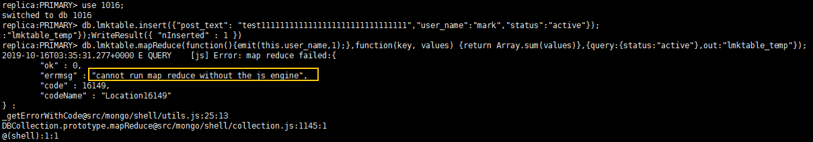
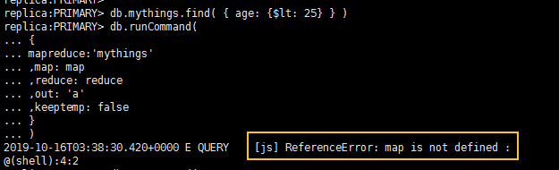

# MapReduce命令

## 命令含义

对大数据集执行map-reduce操作。

## 如何启用MapReduce命令

MapReduce命令由DDS参数组参数“security.javascriptEnabled”控制，默认值为“false”，表示**mapreduce**和**group**命令将无法使用。如果需要使用MapReduce命令，将参数值修改为“true”，修改后需要重启实例才生效。

-   对于集群实例，需要变更全部shard节点关联参数组中对应参数值，再重启实例生效。
-   对于副本集或单节点实例，直接变更实例关联参数组中对应参数值，再重启实例生效。

如何变更参数值请参见[编辑参数组](https://support.huaweicloud.com/usermanual-dds/zh-cn_topic_configuration.html)。

## 使用MapReduce命令失败时常见报错处理

**报错信息**：cannot run map reduce without the js engine或map is not defined

**图 1**  案例一  

**图 2**  案例二  

**可能原因**：MapReduce命令被限制不能使用。

**处理方法**：将实例参数组中参数“security.javascriptEnabled”的值修改为“true”，并重启实例生效，即可使用该命令。

> **说明：**   
>如果实例参数组为默认参数组，由于默认参数组中不允许修改参数值，您可以创建一个参数组，并修改对应参数值，修改后将新参数组关联到该实例，具体请参见[变更参数组](https://support.huaweicloud.com/usermanual-dds/dds_03_0014.html)。  

