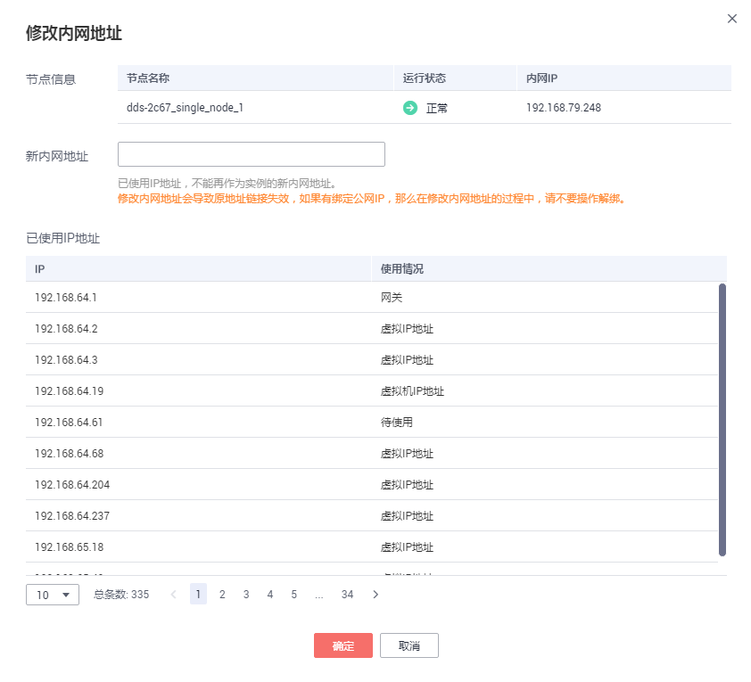

# 修改实例内网地址

## 操作场景

数据库从本地或其他云迁移至文档数据库服务后，可能面临更改内网IP的问题，文档数据库服务提供修改内网地址功能，降低客户迁移成本。

文档数据库服务支持修改如下实例的内网地址：

-   社区版集群实例
-   增强版集群实例
-   社区版副本集实例
-   社区版单节点实例

## 使用限制

修改节点的内网IP会导致原内网IP失效，如果该节点绑定了弹性IP，修改内网IP过程中，请不要操作解绑，修改完成后，查看新内网IP继续绑定至该弹性IP。

## 操作步骤

1.  [登录文档数据库服务](https://support.huaweicloud.com/qs-dds/dds_02_0043.html)。
2.  在“实例管理“页面，选择目标实例，单击实例名称。
3.  在左侧导航树，单击“连接管理“。
4.  在“基本信息“区域的节点上，单击“修改内网地址“。
5.  在弹出框中，填写未使用的新内网地址，单击“确定“。

    **图 1**  修改内网地址  
    

6.  稍后可在“基本信息“区域的节点上查看新内网地址。

