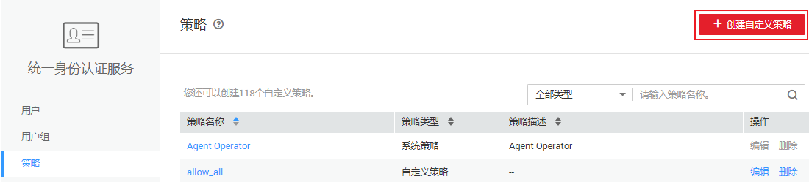
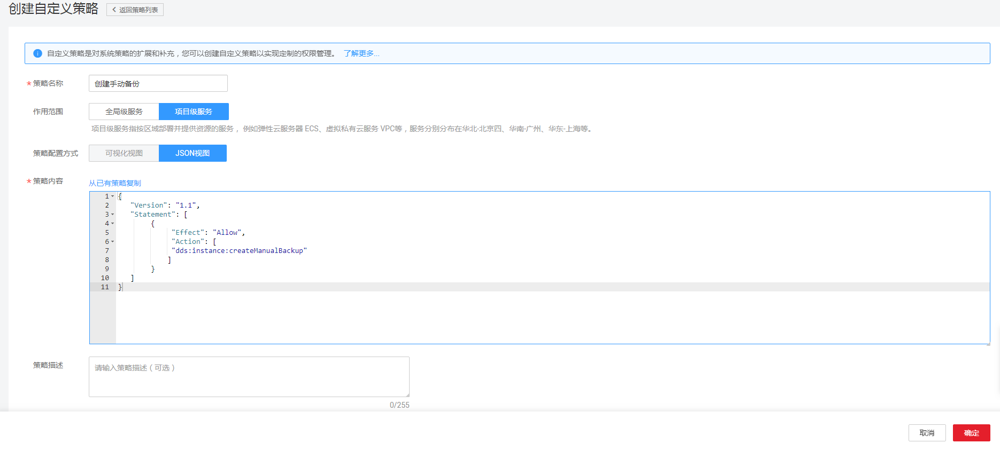

# 创建DDS自定义策略<a name="dds_03_0061"></a>

如果系统预置的DDS权限，不满足您的授权要求，可以创建自定义策略。自定义策略中可以添加的授权项（Action）请参见[文档数据库服务授权项说明](https://support.huaweicloud.com/api-dds/dds_api_0037.html)。如下以定制一个用户仅能创建手动备份的策略为例。

## 前提条件<a name="section121123522046"></a>

-   请先在IAM控制台中开通细粒度策略，开通方法请参见[申请细粒度访问控制公测](https://support.huaweicloud.com/usermanual-iam/iam_01_019.html)。
-   自定义策略需要编写策略（JSON格式），请您先熟悉策略结构，具体请参见[策略语法：细粒度策略](策略语法-细粒度策略.md)。
-   请确定自定义策略需要允许哪些操作，拒绝哪些操作，并获取操作对应的授权项。授权项请参见[文档数据库服务授权项说明](https://support.huaweicloud.com/api-dds/dds_api_0037.html)。

## 操作步骤<a name="section1598019918513"></a>

如下以创建名为“创建手动备份”的策略为例，创建一个仅支持创建手动备份的自定义策略。

1.  在IAM控制台，单击左侧导航栏的“策略”，在右上角选择“创建自定义策略”。

    **图 1**  创建自定义策略<a name="fig1926865518437"></a>  
    

2.  在“创建自定义策略”中，填写如下参数：

    **图 2**  策略基本信息<a name="fig146304134512"></a>  
    

    -   “策略名称”：填写“创建手动备份”。
    -   “作用范围”：根据服务的属性填写，DDS为项目级服务，选择“项目级服务”。
    -   “策略配置方式”：JSON视图。
    -   “策略信息”：将如下内容拷贝至策略信息中，并单击“检验语法”。如下策略表示允许创建手动备份。

        ```
        {
              "Version": "1.1",
              "Statement": [
                    {
                          "Effect": "Allow",
                          "Action": [
                                "dds:instance:createManualBackup"            
                          ]
                    }
              ]
        }
        ```

3.  单击“确定”，自定义策略创建成功。
4.  将新创建的自定义策略授予用户组，使得用户组中的用户仅具备创建手动备份的权限。
5.  用户登录并验证自定义策略定义的权限：创建手动备份。

    权限授予成功后，用户可以通过控制台以及REST API等多种方式验证。此处以登录控制台为例，介绍用户如何验证创建手动备份的权限。

    1.  使用新创建的用户登录华为云，登录方法选择为“IAM用户登录”。
        -   账号名为该IAM用户所属华为云账号的名称。
        -   用户名和密码为账号在IAM创建用户时输入的用户名和密码。

    2.  在文档数据库服务页面，进行创建手动备份操作，操作成功，权限配置正确并已生效。
    3.  尝试进行其他操作，例如：创建文档数据库实例

        系统显示“权限不足”，权限配置正确并已生效。


## 策略样例<a name="section11187162918515"></a>

-   示例1：授权用户创建文档数据库实例

    ```
    {
        "Version": "1.1",
        "Statement": [
            {
                "Effect": "Allow",
                "Action": [
                    "dds:instance:create"
                ]
            }
        ]
    }
    ```

-   示例2：拒绝用户删除文档数据库实例

    拒绝策略需要同时配合其他策略使用，否则没有实际作用。用户被授予的策略中，一个授权项的作用如果同时存在Allow和Deny，则遵循Deny优先。

    如果您给用户授予DDS Admin的系统策略，但不希望用户拥有DDS Admin中定义的删除文档数据库实例权限，您可以创建一条拒绝删除文档数据库实例的自定义策略，然后同时将DDS Admin和拒绝策略授予用户，根据Deny优先原则，则用户可以对DDS执行除了删除文档数据库实例外的所有操作。拒绝策略示例如下：

    ```
    {
        "Version": "1.1",
        "Statement": [
            {
              "Effect": "Deny"
              "Action": [
                    "dds:instance:deleteInstance"
                ],
              }
        ]
    }
    ```


