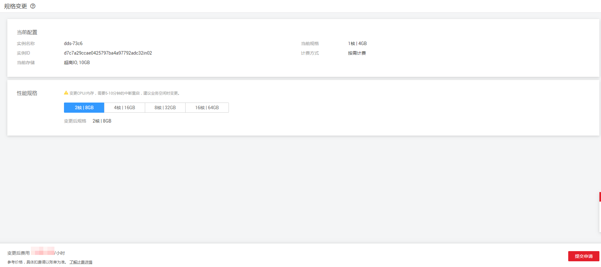

# 变更单节点实例的CPU和内存规格

## 操作场景

当用户购买的单节点实例的CPU和内存规格无法满足业务需要时，可以在控制台进行CPU和内存规格变更。

> **说明：**   
>-   账户余额大于或等于0元，才可以变更规格。  
>-   当实例进行CPU和内存规格变更时，该实例不可被删除。  
>-   用户既可以扩大规格，也可以降低规格。  
>-   变更CPU和内存规格期间，需要5\~10分钟的中断重启，建议业务空闲时变更。  

## 注意事项

-   对于按需计费的实例，变更规格后，依旧按使用时长实时计费。

-   对于包年/包月的实例，规格差价需补交或被退回。
    -   若变更后新规格的价钱高于旧规格，需结合已使用的时间周期，补交差价费用。
    -   若变更后新规格的价钱低于旧规格，需结合已使用的时间周期，退回差价费用。费用将退回至用户的账户，可在控制台右上角的“费用”处，查看账户余额。

## 操作步骤

1.  [登录文档数据库服务](https://support.huaweicloud.com/qs-dds/dds_02_0043.html)。
2.  在“实例管理“页面，选择指定的单节点实例，在“操作”列选择“更多  \>  规格变更“，进入“变更单节点规格”页面。
3.  在“变更单节点规格”页面，选择所需修改到的性能规格，对于“按需计费”实例，单击“提交申请“；对于“包年/包月”实例，单击“立即申请“。

    **图 1**  变更单节点规格  
    

    -   对于“包年/包月”的实例，继续执行[4](#li32430446193548)。
    -   对于“按需计费”的实例，跳过[4](#li32430446193548)，执行[5](#li61310971193548)。

4.  在“规格确认“页面，进行规格确认。
    -   如需重新选择，单击“上一步“，回到“服务选型“页面，修改新增磁盘容量大小。
    -   如果没有问题，单击“去支付”，进入“付款”页面，选择支付方式，完成支付。

5.  查看变更结果。
    -   CPU和内存变更过程中，实例运行状态显示为“规格变更中”，此过程约10分钟。
    -   在实例列表的右上角，单击刷新列表，可看到规格变更完成的实例的运行状态显示为“正常”。
    -   在单节点实例“基本信息”页面的“配置”区域，可查看变更后的实例规格。

