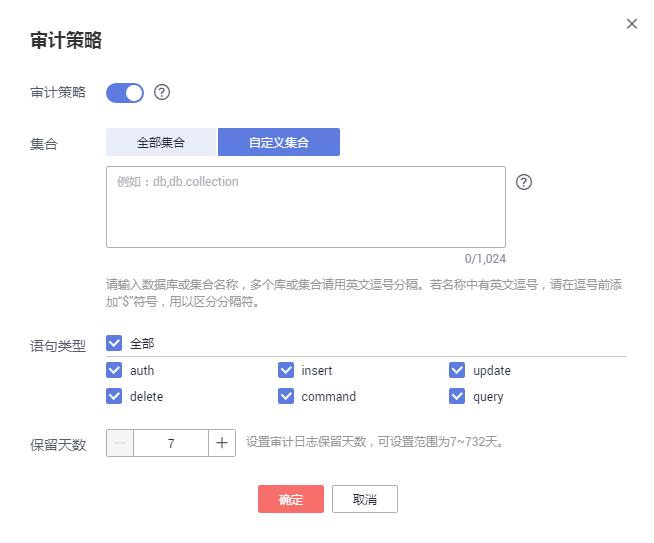
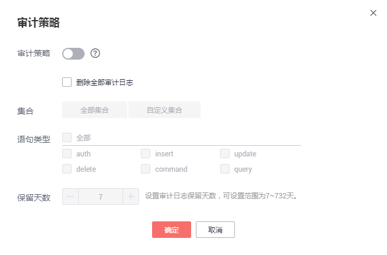

# 审计日志

## 操作场景

文档数据库服务支持审计功能，默认审计日志关闭，打开可能会有一定的性能影响。

审计日志记录您对数据库或集合执行的操作，生成的日志文件将以文件的形式存储在对象存储服务。通过查看日志文件，您可以对数据库进行安全审计，故障根因分析等操作。

## 注意事项

-   文档数据库服务会去检测已生成的审计日志，若审计日志超过用户自定义的保留天数，则将其删除。
-   审计策略修改后，文档数据库服务将按照新的策略执行审计，原审计日志的保留天数以修改后审计策略的保留天数为准。

## 查看审计日志

1.  [登录文档数据库服务](https://support.huaweicloud.com/qs-dds/dds_02_0043.html)。
2.  在“实例管理“页面，选择目标实例，单击实例名称。
3.  在左侧导航树，单击“审计日志“。
4.  在“审计日志“页面，查看详细信息。
    -   对于增强版集群实例，仅支持查看mongos节点的审计日志信息。
    -   可选择查看对应节点在不同时间段的审计日志记录。

## 设置审计策略

1.  [登录文档数据库服务](https://support.huaweicloud.com/qs-dds/dds_02_0043.html)。
2.  在“实例管理“页面，选择目标实例，单击实例名称。
3.  在左侧导航树，单击“审计日志“。
4.  在“审计日志“页面，单击“审计策略“。
5.  在弹出的“审计策略”页面，支持开启、修改、以及关闭审计策略。
    -   开启或修改审计策略

        如需开启审计策略，单击。开启后，可以修改审计策略，如[图1](#fig997925593811)所示。

        **图 1**  修改审计策略  
        

        -   全部集合：表示对该实例下所有集合进行审计。
        -   自定义集合：表示对该实例下指定的数据库或集合进行审计。

            数据库或集合名称不能包含空格和/\\':"\[\]\{\}\(\)特殊字符，“$”符号只能在转义时使用。

            输入单个数据库名称时，长度不能超过64个字符。

            输入单个格式为“数据库.集合”名称时，长度不能超过120个字符。其中，数据库名称不能超过64个字符，集合名称不能为空、不能包含“null”、不能以“system.”作为前缀。

        -   语句类型：支持查询集合下指定语句的审计日志，包括auth、insert、update、delete、command、query语句。
        -   保留天数是指审计日志可保留的时间，取值范围为7～732天。

        单击“确定”，确认修改。修改完成后，将根据新的策略生成日志，原有日志的保留天数以修改后审计策略的保留天数为准。

    -   关闭审计策略

        > **说明：**   
        >关闭审计策略后，文档数据库服务将不再生成审计日志。  

        如需关闭审计策略，单击。关闭后，如[图2](#fig134610161448)所示。

        **图 2**  关闭审计策略  
        

        选择是否删除全部审计日志：

        -   不勾选，将保留当前还在保留天数内的日志文件，后期可手动删除。
        -   勾选，删除当前还在保留天数内的日志文件。

        单击“确定”，确认关闭。

## 下载日志文件

1.  [登录文档数据库服务](https://support.huaweicloud.com/qs-dds/dds_02_0043.html)。
2.  在“实例管理“页面，选择目标实例，单击实例名称。
3.  在左侧导航树，单击“审计日志“。
4.  在“审计日志“页面，在日志文件上单击“下载“，下载审计日志。
    -   系统会自动加载下载准备任务，加载时长受日志文件大小及网络环境影响。
    -   下载链接有效期为5分钟。如果超时，提示用户下载链接已失效，是否重新下载。如果需要重新下载，单击“确定”，否则，单击“取消”。

