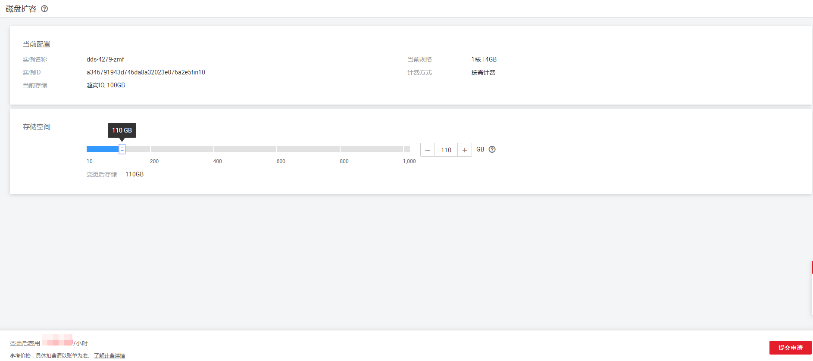

# 扩容存储（社区增强版）

## 操作场景

随着业务数据的增加，原来申请的数据库存储容量不能满足需求。这时，您需要为实例进行存储扩容。

> **说明：**   
>-   故障、创建中、分片扩容中、分片缩容中的实例不可扩容。  
>-   社区增强版包周期实例暂不支持扩容存储。  
>-   存储容量变更只允许扩容，不能缩容。  

## 操作步骤

1.  [登录文档数据库服务](https://support.huaweicloud.com/qs-dds/dds_02_0043.html)。
2.  在“实例管理“页面，选择指定的增强版实例，单击实例名称。
3.  在“基本信息“页面的“存储空间“区域，单击“磁盘扩容“，进入“磁盘扩容”页面。
4.  在“磁盘扩容”页面，选择所需扩容到的磁盘容量，单击“提交申请“。

    **图 1**  扩容集群存储  
    

    用户每次至少选择10GB扩容量，且必须为10的整数倍，扩容的最大限制由分片规格和数量来决定，请参见[购买实例（社区增强版）](https://support.huaweicloud.com/qs-dds/dds_02_0034.html)中“存储空间上限”的说明。

5.  检查存储扩容结果。
    -   存储扩容过程中，实例运行状态显示为“存储扩容中”，此过程约3～5分钟。
    -   在实例列表的右上角，单击刷新列表，可看到存储扩容完成的实例的运行状态显示为“正常”。
    -   在集群实例“基本信息”页面的“存储”区域，可查看扩容后的磁盘容量。

