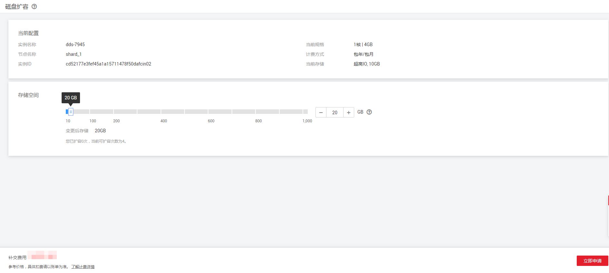
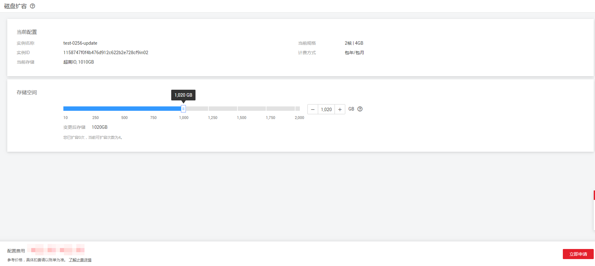

# 扩容存储（社区版）

## 操作场景

随着业务数据的增加，原来申请的数据库存储容量不能满足需求，这时，您需要为实例进行存储扩容。

> **说明：**   
>-   每个实例最多只能扩容八次。  
>-   故障的实例不可扩容。  
>-   创建中、规格变更中、节点扩容中、删除节点中的实例不可扩容。  
>-   存储容量变更只允许扩容，不能缩容。  
>-   选择磁盘加密的实例，新扩容的磁盘空间依然会使用原加密密钥进行加密。  
>-   对于高可用类型为集群的实例，config节点不能进行磁盘扩容。  

## 集群

1.  [登录文档数据库服务](https://support.huaweicloud.com/qs-dds/dds_02_0043.html)。
2.  在“实例管理“页面，选择指定的集群实例，单击实例名称。
3.  在“基本信息“页面的“节点信息“区域，选择“shard“页签，在shard节点的“操作”列，单击“磁盘扩容”，进入“扩容shard磁盘”页面。
4.  在“扩容shard磁盘”页面，选择所需扩容磁盘空间大小，单击“下一步“。

    **图 1**  扩容shard磁盘  
    

    用户每次至少选择10GB扩容量，且必须为10的整数倍，扩容的最大限制为2000GB。

5.  在确认页面，确认存储空间。
    -   包年/包月
        -   如需重新选择，单击“上一步”，修改存储空间。
        -   核对无误后，单击“提交订单”，进入付款页面，选择支付方式，完成支付。

    -   按需计费
        -   如需重新选择，单击“上一步”，修改存储空间。
        -   核对无误后，单击“提交“，开始扩容存储。

6.  检查存储扩容结果。
    -   存储扩容过程中，实例运行状态显示为“存储扩容中”，此过程约3～5分钟。
    -   在实例列表的右上角，单击刷新列表，可看到存储扩容完成的实例的运行状态显示为“正常”。
    -   在集群实例“基本信息”页面的“节点信息“区域，选择“shard“页签，在shard节点的“存储空间使用情况”栏，可查看扩容后的磁盘容量。

## 副本集

1.  [登录文档数据库服务](https://support.huaweicloud.com/qs-dds/dds_02_0043.html)。
2.  在“实例管理“页面，选择指定的副本集实例，在“操作”列单击“磁盘扩容“，进入“扩容副本集磁盘”页面。
3.  在“扩容副本集磁盘”页面，选择所需扩容磁盘空间大小，单击“下一步“。

    **图 2**  扩容副本集磁盘  
    

    用户每次至少选择10GB扩容量，且必须为10的整数倍，最大扩容到的磁盘容量为2000GB。

4.  在确认页面，确认存储空间。
    -   包年/包月
        -   如需重新选择，单击“上一步”，修改存储空间。
        -   核对无误后，单击“提交订单”，进入付款页面，选择支付方式，完成支付。

    -   按需计费
        -   如需重新选择，单击“上一步”，修改存储空间。
        -   核对无误后，单击“提交“，开始扩容存储。

5.  检查存储扩容结果。
    -   存储扩容过程中，实例运行状态显示为“存储扩容中”，此过程约3～5分钟。
    -   在实例列表的右上角，单击刷新列表，可看到存储扩容完成的实例的运行状态显示为“正常”。
    -   在副本集实例“基本信息”页面的“存储空间”区域，可查看扩容后的磁盘容量。

## 单节点

1.  [登录文档数据库服务](https://support.huaweicloud.com/qs-dds/dds_02_0043.html)。
2.  在“实例管理“页面，选择指定的单节点实例，在“操作”列单击“磁盘扩容“，进入“扩容单节点”页面。
3.  在“扩容单节点磁盘”页面，选择所需扩容磁盘空间大小，单击“下一步“。

    **图 3**  扩容单节点磁盘  
    

    用户每次至少选择10GB扩容量，且必须为10的整数倍，最大扩容到的磁盘容量为1000GB。

4.  在确认页面，确认存储空间。
    -   包年/包月
        -   如需重新选择，单击“上一步”，修改存储空间。
        -   核对无误后，单击“提交订单”，进入付款页面，选择支付方式，完成支付。

    -   按需计费
        -   如需重新选择，单击“上一步”，修改存储空间。
        -   核对无误后，单击“提交“，开始扩容存储。

5.  检查存储扩容结果。
    -   存储扩容过程中，实例运行状态显示为“存储扩容中”，此过程约3～5分钟。
    -   在实例列表的右上角，单击刷新列表，可看到存储扩容完成的实例的运行状态显示为“正常”。
    -   在单节点实例“基本信息”页面的“存储空间”区域，可查看扩容后的磁盘容量。

