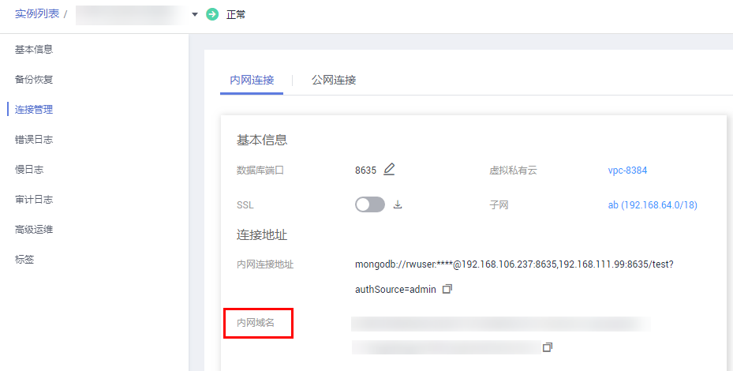

# 查看内网域名

DDS社区增强版实例支持生成内网域名，实例创建成功后，默认可以查看内网域名，通过内网域名连接实例。

## 使用限制

-   目前，仅DDS社区增强版实例支持生成内网域名。

## 操作步骤

1.  [登录文档数据库服务](https://support.huaweicloud.com/qs-dds/dds_02_0043.html)。
2.  在“实例管理“页面，选择指定的实例，单击实例名称。
3.  在左侧导航树，单击“连接管理“。
4.  在“基本信息“区域的“内网域名“处，查看生成的内网域名。

    **图 1**  查看内网域名  
    

