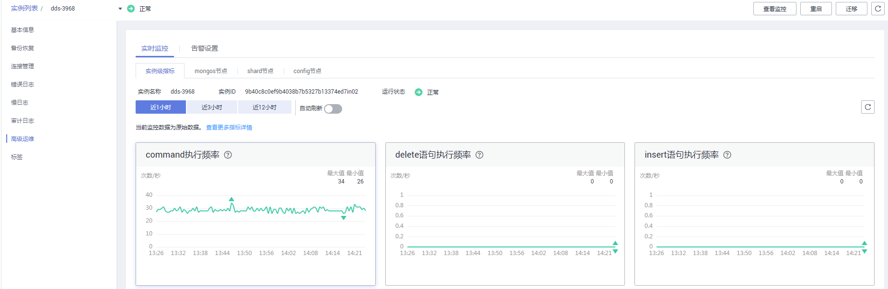

# 查看监控指标

## 操作场景

云监控可以对文档数据库服务的运行状态进行日常监控。您可以通过管理控制台，直观地查看文档数据库服务的各项监控指标。

由于监控数据的获取与传输会花费一定时间，因此，云监控显示的是当前时间5～10分钟前的监控状态。如果您的实例刚刚创建完成，请等待5～10分钟后查看监控数据。

## 前提条件

-   文档数据库实例正常运行。

    故障或已删除的文档数据库实例或节点，无法查看其监控指标。当再次启动或恢复后，即可正常查看。

-   文档数据库实例已正常运行一段时间（约10分钟）。

    对于新创建的文档数据库实例，需要等待一段时间，才能查看上报的监控数据和监控视图。

## 操作步骤

1.  [登录文档数据库服务](https://support.huaweicloud.com/qs-dds/dds_02_0043.html)。
2.  在“实例管理“页面，选择指定的实例，单击实例名称。
3.  在左侧导航树，单击“高级运维“。
4.  对于集群实例，支持查看实例级指标和节点指标；对于副本集和单节点实例，支持查看节点指标。下图以集群实例为例。

    **图 1**  集群实例监控信息  
    

5.  在监控指标区域，您可以选择监控时长，查看对应时间段的监控数据。
    -   支持查看文档数据库服务近1小时、近3小时和近12小时的监控数据。
    -   开启“自动刷新”开关后，可自动刷新监控数据，刷新周期为60s。
    -   更多指标信息，可单击“查看更多指标详情”，跳转到云监控界面查看。

