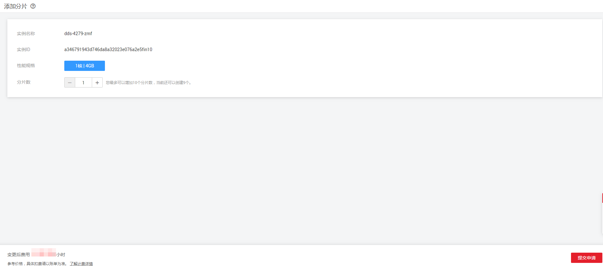

# 添加集群实例的分片（社区增强版）

## 操作场景

随着业务数据的增加，原来申请的数据库分片数量不能满足需求。这时您需要对实例进行新增分片。

> **说明：**   
>-   实例状态为正常、删除备份中和恢复检查中时可以添加分片。  
>-   社区增强版包周期实例暂不支持添加分片。  
>-   实例进行添加分片时，该实例不可被删除。  

## 操作步骤

1.  [登录文档数据库服务](https://support.huaweicloud.com/qs-dds/dds_02_0043.html)。
2.  在“实例管理“页面，选择指定的增强版实例，单击实例名称。
3.  在“基本信息“页面的“节点信息“区域，单击“添加分片“。
4.  在“添加分片”页面，选择新增分片数量，单击“下一步“。

    **图 1**  添加分片  
    

    增强版集群实例最多支持12个分片。

5.  在确认页面，确认分片配置信息。
    -   如需重新选择，单击“上一步“，修改相关配置。
    -   核对无误后，单击“提交“，开始添加分片。

6.  查看添加分片结果。
    -   添加分片过程中，实例运行状态显示为“分片扩容中”，此过程约10～15分钟。
    -   在实例列表的右上角，单击刷新列表，可看到添加分片完成的实例的运行状态显示为“正常”。
    -   在实例“基本信息”页面的“节点信息”区域，可查看新增分片信息。
    -   若添加分片失败，可进行回退，详见[回退集群实例的分片（社区增强版）](回退集群实例的分片（社区增强版）.md)。

