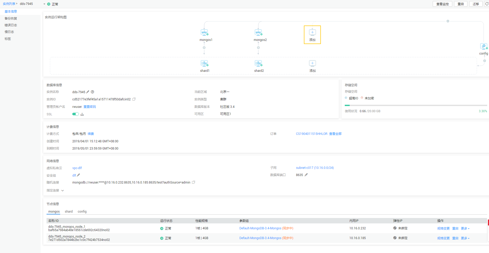
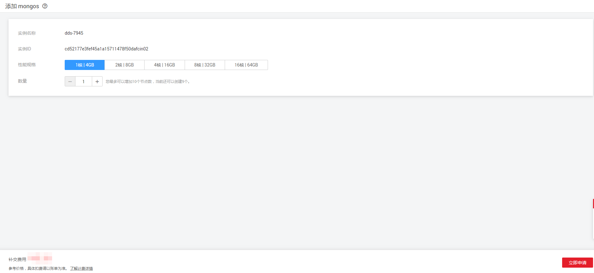
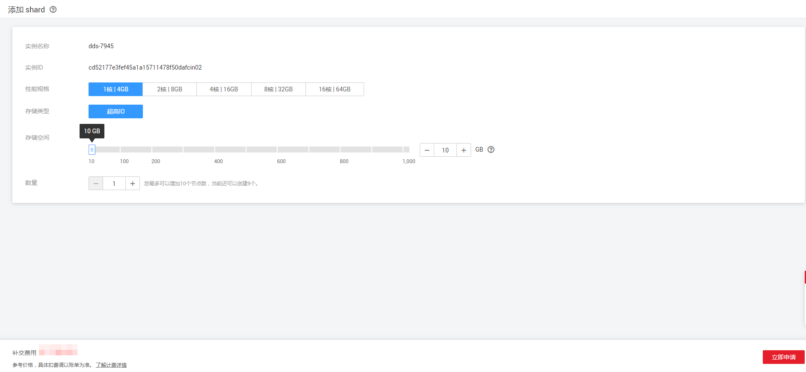

# 添加集群实例的节点（社区版）

## 操作场景

随着业务数据的增加，原来申请的数据库节点数量不能满足需求。这时您需要对实例进行新增节点。

> **说明：**   
>-   账户余额大于等于0元，才可添加节点。  
>-   实例状态为正常、删除备份中和恢复检查中时可以添加节点。  
>-   实例进行添加节点时，该实例不可被删除。  

## 添加mongos

1.  [登录文档数据库服务](https://support.huaweicloud.com/qs-dds/dds_02_0043.html)。
2.  在“实例管理“页面，选择指定的集群实例，单击实例名称。
3.  在“基本信息“页面“实例运行架构图“区域的mongos节点处，单击，进入“添加mongos”页面。

    **图 1**  社区版实例基本信息  
    

4.  在“添加mongos”页面，选择性能规格和节点数量，对于“按需计费”实例，单击“提交申请“；对于“包年/包月”实例，单击“立即申请“。

    **图 2**  添加mongos  
    

    社区版集群实例最多支持12个mongos节点。

    -   对于“包年/包月”的实例，继续执行[5](#le0510c82a1db4c6a83e9bbe4600f52db)。
    -   对于“按需计费”的实例，跳过[5](#le0510c82a1db4c6a83e9bbe4600f52db)，执行[6](#li55760807163532)。

5.  在“规格确认”页面，进行规格确认。
    -   如需重新选择，单击“上一步“，回到“服务选型“页面，修改相关配置。
    -   如果没有问题，单击“去支付”，进入“付款”页面，选择支付方式，完成支付。

6.  查看添加节点结果。
    -   添加节点过程中，实例运行状态显示为“节点扩容中”，此过程约10～15分钟。
    -   在实例列表的右上角，单击刷新列表，可看到添加节点完成的实例的运行状态显示为“正常”。
    -   在实例“基本信息”页面的“节点信息“区域，选择“mongos”页签，可查看新增mongos节点信息。
    -   若添加mongos节点失败，可进行批量回退或单个删除操作，详见[回退集群实例的节点（社区版）](回退集群实例的节点（社区版）.md)。

## 添加shard

1.  [登录文档数据库服务](https://support.huaweicloud.com/qs-dds/dds_02_0043.html)。
2.  在“实例管理“页面，选择指定的集群实例，单击实例名称。
3.  在“基本信息“页面“实例运行架构图“区域的shard节点处，单击，进入“添加shard”页面。
4.  在“添加shard”页面，选择新增shard对应的性能规格、存储空间和节点数量，对于“按需计费”实例，单击“提交申请“；对于“包年/包月”实例，单击“立即申请“。

    **图 3**  添加shard  
    

    -   申请的存储空间会有必要的文件系统开销，包括索引节点和保留块，以及数据库运行必需的空间。存储空间的数值必须为10的整数倍。
    -   社区版集群实例最多支持12个shard节点。
    -   对于“包年/包月”的实例，继续执行[5](#li350143816353)。
    -   对于“按需计费”的实例，跳过[5](#li350143816353)，执行[6](#li1418047816353)。

5.  在“规格确认”页面，进行规格确认。
    -   如需重新选择，单击“上一步“，回到“服务选型“页面，修改相关配置。
    -   如果没有问题，单击“去支付”，进入“付款”页面，选择支付方式，完成支付。

6.  查看添加节点结果。
    -   添加节点过程中，实例运行状态显示为“节点扩容中”，此过程约10～15分钟。
    -   在实例列表的右上角，单击刷新列表，可看到添加节点完成的实例的运行状态显示为“正常”。
    -   在实例“基本信息”页面的“节点信息“区域，选择“shard”页签，可查看新增shard节点信息。
    -   若添加shard节点失败，可进行批量回退或单个删除操作，详见[回退集群实例的节点（社区版）](回退集群实例的节点（社区版）.md)。

