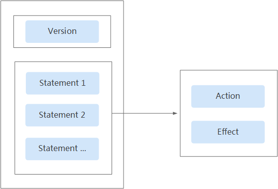
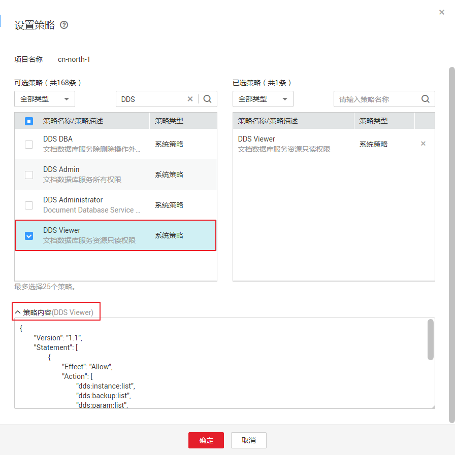
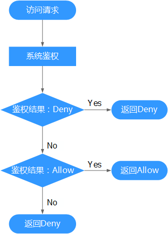

# 策略语法：细粒度策略<a name="dds_03_0062"></a>

## 策略结构<a name="section171095414511"></a>

策略结构包括：Version（策略版本号）和Statement（策略权限语句），其中Statement可以有多个，表示不同的授权项。

**图 1**  策略结构<a name="fig20980305611"></a>  


## 策略语法<a name="section17135436618"></a>

如下以“DDS Viewer”策略为例，说明策略语法组成。

**图 2**  DDS Viewer策略<a name="fig440864461110"></a>  


```
{
        "Version": "1.1",
        "Statement": [
                {
                        "Effect": "Allow",
                        "Action": [
                                "dds:instance:list",
                                "dds:backup:list",
                                "dds:param:list",
                                "vpc:*:list",
                                "vpc:*:get",
                                "dss:*:get",
                                "dss:*:list",
                                "ecs:*:get*",
                                "ecs:*:list*"
                        ]
                }
        ]
}
```

-   Version：标识策略的版本号，主要用于区分Role-Based Access Control（RBAC）策略和细粒度策略。
    -   1.0：RBAC策略。RBAC策略是将服务作为一个整体进行授权，授权后，用户可以拥有这个服务的所有权限。
    -   1.1：细粒度策略。相比RBAC策略，细粒度策略基于服务的API接口进行权限拆分，授权更加精细。授权后，用户可以对这个服务执行特定的操作。细粒度策略包括系统预置和用户自定义两种：

-   Statement：策略授权语句，描述策略的详细信息，包含Effect（作用）和Action（授权项）。
    -   Effect（作用）

        作用包含两种：Allow（允许）和Deny（Deny），系统预置策略仅包含允许的授权语句，自定义策略中可以同时包含允许和拒绝的授权语句，当策略中既有允许又有拒绝的授权语句时，遵循Deny优先的原则。

    -   Action（授权项）

        对资源的具体操作权限，格式为：服务名:资源类型:操作，支持单个或多个操作权限，支持通配符号\*，通配符号表示所有。

        示例：

        "ecs:\*:get\*"，其中ecs为服务名，\*为资源类型，get\*为操作，该授权项表示ECS所有的资源类型的查询权限。


## 多个授权项策略<a name="section191391131571"></a>

一个自定义策略中可以包含多个授权项，且除了可以包含本服务的授权项外，还可以包含其他服务的授权项，可以包含的其他服务必须跟本服务同属性，即都是项目级服务或都是全局级服务。多个授权语句策略描述如下：

```
{ 
        "Version": "1.1", 
        "Statement": [ 
                { 
                        "Action": [ 
                                "dds:instance:create",
                                "dds:instance:list",
                                "dds:backup:list",
                                "dds:param:list",
                                "vpc:*:list",
                                "vpc:*:get",
                                "dss:*:get",
                                "dss:*:list",
                                "ecs:*:get*",
                                "ecs:*:list*"
                        ], 
                        "Effect": "Allow" 
                } 
        ] 
}
```

## 拒绝策略<a name="section743754511715"></a>

拒绝策略需要同时配合其他策略使用，否则没有实际作用。用户被授予的策略中，一个授权项的作用如果同时存在Allow和Deny，则遵循Deny优先。

如果您给用户授予DDS Admin的系统策略，但不希望用户拥有DDS Admin中定义的删除文档数据库实例权限（dds:instance:deleteInstance），您可以创建一条相同Action的自定义策略，并将自定义策略的Effect设置为Deny，然后同时将DDS Admin和拒绝策略授予用户，根据Deny优先原则，则用户可以对DDS执行除了删除文档数据库实例外的所有操作。以下策略样例表示：拒绝用户删除文档数据库实例。

```
{ 
      "Version": "1.1", 
      "Statement": [ 
            { 
            "Effect": "Deny", 
                  "Action": [ 
                        "dds:instance:deleteInstance" 
                  ] 
            } 
      ] 
}
```

## 检查规则<a name="section1758041080"></a>

当用户被授予多个策略，或者一个策略中包含多个授权语句，这些策略中既有Allow又有Deny的授权语句时，遵循Deny优先的原则。在用户访问资源时，权限检查逻辑如下：

**图 3**  系统鉴权逻辑图<a name="fig088494019813"></a>  


> **说明：**   
>每条策略做评估时， Action之间是或\(or\)的关系。  

1.  用户访问系统，发起操作请求。
2.  系统评估用户被授予的访问策略，鉴权开始。
3.  在用户被授予的访问策略中，系统将优先寻找显式拒绝指令。如找到一个适用的显式拒绝，系统将返回Deny决定。
4.  如果没有找到显式拒绝指令，系统将寻找适用于请求的任何Allow指令。如果找到一个显式允许指令，系统将返回Allow决定。
5.  如果找不到显式允许，最终决定为Deny，鉴权结束。

## 系统策略<a name="section1281824810211"></a>

更多DDS支持的系统策略及策略间的对比，请参见：[DDS系统策略](https://support.huaweicloud.com/productdesc-dds/dds_01_0019.html)。

**表 1**  DDS系统策略

<a name="table779819286235"></a>
<table><thead align="left"><tr id="zh-cn_topic_0173387908_row84531054710"><th class="cellrowborder" valign="top" width="21.42785721427857%" id="mcps1.2.5.1.1"><p id="zh-cn_topic_0173387908_p104521084712"><a name="zh-cn_topic_0173387908_p104521084712"></a><a name="zh-cn_topic_0173387908_p104521084712"></a>策略名称</p>
</th>
<th class="cellrowborder" valign="top" width="37.75622437756224%" id="mcps1.2.5.1.2"><p id="zh-cn_topic_0173387908_p1145121017478"><a name="zh-cn_topic_0173387908_p1145121017478"></a><a name="zh-cn_topic_0173387908_p1145121017478"></a>描述</p>
</th>
<th class="cellrowborder" valign="top" width="19.388061193880613%" id="mcps1.2.5.1.3"><p id="zh-cn_topic_0173387908_p5456103478"><a name="zh-cn_topic_0173387908_p5456103478"></a><a name="zh-cn_topic_0173387908_p5456103478"></a>策略类别</p>
</th>
<th class="cellrowborder" valign="top" width="21.42785721427857%" id="mcps1.2.5.1.4"><p id="zh-cn_topic_0173387908_p1445111014474"><a name="zh-cn_topic_0173387908_p1445111014474"></a><a name="zh-cn_topic_0173387908_p1445111014474"></a>依赖关系</p>
</th>
</tr>
</thead>
<tbody><tr id="zh-cn_topic_0173387908_row8451710144718"><td class="cellrowborder" valign="top" width="21.42785721427857%" headers="mcps1.2.5.1.1 "><p id="zh-cn_topic_0173387908_p545171044716"><a name="zh-cn_topic_0173387908_p545171044716"></a><a name="zh-cn_topic_0173387908_p545171044716"></a>DDS Admin</p>
</td>
<td class="cellrowborder" valign="top" width="37.75622437756224%" headers="mcps1.2.5.1.2 "><p id="zh-cn_topic_0173387908_p134551013478"><a name="zh-cn_topic_0173387908_p134551013478"></a><a name="zh-cn_topic_0173387908_p134551013478"></a>文档数据库服务所有权限。</p>
</td>
<td class="cellrowborder" valign="top" width="19.388061193880613%" headers="mcps1.2.5.1.3 "><p id="zh-cn_topic_0173387908_p58320004614"><a name="zh-cn_topic_0173387908_p58320004614"></a><a name="zh-cn_topic_0173387908_p58320004614"></a>细粒度策略</p>
</td>
<td class="cellrowborder" valign="top" width="21.42785721427857%" headers="mcps1.2.5.1.4 "><p id="zh-cn_topic_0173387908_p9461106473"><a name="zh-cn_topic_0173387908_p9461106473"></a><a name="zh-cn_topic_0173387908_p9461106473"></a>无</p>
</td>
</tr>
<tr id="zh-cn_topic_0173387908_row17111148135818"><td class="cellrowborder" valign="top" width="21.42785721427857%" headers="mcps1.2.5.1.1 "><p id="zh-cn_topic_0173387908_p09917145811"><a name="zh-cn_topic_0173387908_p09917145811"></a><a name="zh-cn_topic_0173387908_p09917145811"></a>DDS Viewer</p>
</td>
<td class="cellrowborder" valign="top" width="37.75622437756224%" headers="mcps1.2.5.1.2 "><p id="zh-cn_topic_0173387908_p1191173585"><a name="zh-cn_topic_0173387908_p1191173585"></a><a name="zh-cn_topic_0173387908_p1191173585"></a>文档数据库服务只读权限，拥有该权限的用户仅能查看文档数据库服务数据。</p>
</td>
<td class="cellrowborder" valign="top" width="19.388061193880613%" headers="mcps1.2.5.1.3 "><p id="zh-cn_topic_0173387908_p119662033175813"><a name="zh-cn_topic_0173387908_p119662033175813"></a><a name="zh-cn_topic_0173387908_p119662033175813"></a>细粒度策略</p>
</td>
<td class="cellrowborder" valign="top" width="21.42785721427857%" headers="mcps1.2.5.1.4 "><p id="zh-cn_topic_0173387908_p109417155818"><a name="zh-cn_topic_0173387908_p109417155818"></a><a name="zh-cn_topic_0173387908_p109417155818"></a>无</p>
</td>
</tr>
<tr id="zh-cn_topic_0173387908_row194651004718"><td class="cellrowborder" valign="top" width="21.42785721427857%" headers="mcps1.2.5.1.1 "><p id="zh-cn_topic_0173387908_p84681010472"><a name="zh-cn_topic_0173387908_p84681010472"></a><a name="zh-cn_topic_0173387908_p84681010472"></a>DDS Administrator</p>
</td>
<td class="cellrowborder" valign="top" width="37.75622437756224%" headers="mcps1.2.5.1.2 "><p id="zh-cn_topic_0173387908_p54651521640"><a name="zh-cn_topic_0173387908_p54651521640"></a><a name="zh-cn_topic_0173387908_p54651521640"></a>操作权限：</p>
<a name="zh-cn_topic_0173387908_ul2028340843"></a><a name="zh-cn_topic_0173387908_ul2028340843"></a><ul id="zh-cn_topic_0173387908_ul2028340843"><li>拥有该权限的用户同时拥有Tenant Guest和Server Administrator权限时，可以对DDS执行任意操作，例如：创建、删除、重启、扩容、恢复实例，配置数据库参数等操作。</li><li>拥有该权限的用户没有Tenant Guest或Server Administrator权限，将无法正常使用DDS。</li><li>拥有VPC Administrator权限的用户可以创建VPC或子网。</li><li>拥有CES Administrator权限的用户可以修改或添加对实例的告警规则。</li></ul>
</td>
<td class="cellrowborder" valign="top" width="19.388061193880613%" headers="mcps1.2.5.1.3 "><p id="zh-cn_topic_0173387908_p582710164612"><a name="zh-cn_topic_0173387908_p582710164612"></a><a name="zh-cn_topic_0173387908_p582710164612"></a>RBAC策略</p>
</td>
<td class="cellrowborder" valign="top" width="21.42785721427857%" headers="mcps1.2.5.1.4 "><p id="zh-cn_topic_0173387908_p847121019471"><a name="zh-cn_topic_0173387908_p847121019471"></a><a name="zh-cn_topic_0173387908_p847121019471"></a>依赖Tenant Guest和Tenant Administrator策略，在同项目中勾选依赖的策略。</p>
<p id="zh-cn_topic_0173387908_p4316111619123"><a name="zh-cn_topic_0173387908_p4316111619123"></a><a name="zh-cn_topic_0173387908_p4316111619123"></a>如果配置了DDS企业项目，需要在同项目中勾选DAS Admin策略，才可以通过DDS界面登录到DAS服务。</p>
</td>
</tr>
</tbody>
</table>

**表 2**  常用操作与系统策略的关系

<a name="table122781728172415"></a>
<table><thead align="left"><tr id="zh-cn_topic_0173387908_row39127412487"><th class="cellrowborder" valign="top" width="24.099999999999998%" id="mcps1.2.5.1.1"><p id="zh-cn_topic_0173387908_p1491219474819"><a name="zh-cn_topic_0173387908_p1491219474819"></a><a name="zh-cn_topic_0173387908_p1491219474819"></a>操作名称</p>
</th>
<th class="cellrowborder" valign="top" width="26.57%" id="mcps1.2.5.1.2"><p id="zh-cn_topic_0173387908_p9325131315919"><a name="zh-cn_topic_0173387908_p9325131315919"></a><a name="zh-cn_topic_0173387908_p9325131315919"></a>DDS Admin</p>
</th>
<th class="cellrowborder" valign="top" width="26.3%" id="mcps1.2.5.1.3"><p id="zh-cn_topic_0173387908_p2605221692"><a name="zh-cn_topic_0173387908_p2605221692"></a><a name="zh-cn_topic_0173387908_p2605221692"></a>DDS Viewer</p>
</th>
<th class="cellrowborder" valign="top" width="23.03%" id="mcps1.2.5.1.4"><p id="zh-cn_topic_0173387908_p29771165109"><a name="zh-cn_topic_0173387908_p29771165109"></a><a name="zh-cn_topic_0173387908_p29771165109"></a>DDS Administrator</p>
</th>
</tr>
</thead>
<tbody><tr id="zh-cn_topic_0173387908_row19121343489"><td class="cellrowborder" valign="top" width="24.099999999999998%" headers="mcps1.2.5.1.1 "><p id="zh-cn_topic_0173387908_p1491211419486"><a name="zh-cn_topic_0173387908_p1491211419486"></a><a name="zh-cn_topic_0173387908_p1491211419486"></a><span>创建实例</span></p>
</td>
<td class="cellrowborder" valign="top" width="26.57%" headers="mcps1.2.5.1.2 "><p id="zh-cn_topic_0173387908_p199121245489"><a name="zh-cn_topic_0173387908_p199121245489"></a><a name="zh-cn_topic_0173387908_p199121245489"></a>√</p>
</td>
<td class="cellrowborder" valign="top" width="26.3%" headers="mcps1.2.5.1.3 "><p id="zh-cn_topic_0173387908_p991214124819"><a name="zh-cn_topic_0173387908_p991214124819"></a><a name="zh-cn_topic_0173387908_p991214124819"></a>x</p>
</td>
<td class="cellrowborder" valign="top" width="23.03%" headers="mcps1.2.5.1.4 "><p id="zh-cn_topic_0173387908_p199122417488"><a name="zh-cn_topic_0173387908_p199122417488"></a><a name="zh-cn_topic_0173387908_p199122417488"></a>√</p>
</td>
</tr>
<tr id="zh-cn_topic_0173387908_row16403175118157"><td class="cellrowborder" valign="top" width="24.099999999999998%" headers="mcps1.2.5.1.1 "><p id="zh-cn_topic_0173387908_p84049517156"><a name="zh-cn_topic_0173387908_p84049517156"></a><a name="zh-cn_topic_0173387908_p84049517156"></a>查询实例列表</p>
</td>
<td class="cellrowborder" valign="top" width="26.57%" headers="mcps1.2.5.1.2 "><p id="zh-cn_topic_0173387908_p106211502166"><a name="zh-cn_topic_0173387908_p106211502166"></a><a name="zh-cn_topic_0173387908_p106211502166"></a>√</p>
</td>
<td class="cellrowborder" valign="top" width="26.3%" headers="mcps1.2.5.1.3 "><p id="zh-cn_topic_0173387908_p459973181614"><a name="zh-cn_topic_0173387908_p459973181614"></a><a name="zh-cn_topic_0173387908_p459973181614"></a>√</p>
</td>
<td class="cellrowborder" valign="top" width="23.03%" headers="mcps1.2.5.1.4 "><p id="zh-cn_topic_0173387908_p1079415109165"><a name="zh-cn_topic_0173387908_p1079415109165"></a><a name="zh-cn_topic_0173387908_p1079415109165"></a>√</p>
</td>
</tr>
<tr id="zh-cn_topic_0173387908_row591224184813"><td class="cellrowborder" valign="top" width="24.099999999999998%" headers="mcps1.2.5.1.1 "><p id="zh-cn_topic_0173387908_p1491234134818"><a name="zh-cn_topic_0173387908_p1491234134818"></a><a name="zh-cn_topic_0173387908_p1491234134818"></a><span>删除实例</span></p>
</td>
<td class="cellrowborder" valign="top" width="26.57%" headers="mcps1.2.5.1.2 "><p id="zh-cn_topic_0173387908_p11912742488"><a name="zh-cn_topic_0173387908_p11912742488"></a><a name="zh-cn_topic_0173387908_p11912742488"></a>√</p>
</td>
<td class="cellrowborder" valign="top" width="26.3%" headers="mcps1.2.5.1.3 "><p id="zh-cn_topic_0173387908_p12643729201515"><a name="zh-cn_topic_0173387908_p12643729201515"></a><a name="zh-cn_topic_0173387908_p12643729201515"></a>x</p>
</td>
<td class="cellrowborder" valign="top" width="23.03%" headers="mcps1.2.5.1.4 "><p id="zh-cn_topic_0173387908_p891218414488"><a name="zh-cn_topic_0173387908_p891218414488"></a><a name="zh-cn_topic_0173387908_p891218414488"></a>√</p>
</td>
</tr>
<tr id="zh-cn_topic_0173387908_row1291211419484"><td class="cellrowborder" valign="top" width="24.099999999999998%" headers="mcps1.2.5.1.1 "><p id="zh-cn_topic_0173387908_p1112170111115"><a name="zh-cn_topic_0173387908_p1112170111115"></a><a name="zh-cn_topic_0173387908_p1112170111115"></a>重启实例</p>
</td>
<td class="cellrowborder" valign="top" width="26.57%" headers="mcps1.2.5.1.2 "><p id="zh-cn_topic_0173387908_p79131544482"><a name="zh-cn_topic_0173387908_p79131544482"></a><a name="zh-cn_topic_0173387908_p79131544482"></a>√</p>
</td>
<td class="cellrowborder" valign="top" width="26.3%" headers="mcps1.2.5.1.3 "><p id="zh-cn_topic_0173387908_p3913174124813"><a name="zh-cn_topic_0173387908_p3913174124813"></a><a name="zh-cn_topic_0173387908_p3913174124813"></a>x</p>
</td>
<td class="cellrowborder" valign="top" width="23.03%" headers="mcps1.2.5.1.4 "><p id="zh-cn_topic_0173387908_p18913641488"><a name="zh-cn_topic_0173387908_p18913641488"></a><a name="zh-cn_topic_0173387908_p18913641488"></a>√</p>
</td>
</tr>
<tr id="zh-cn_topic_0173387908_row118621042121820"><td class="cellrowborder" valign="top" width="24.099999999999998%" headers="mcps1.2.5.1.1 "><p id="zh-cn_topic_0173387908_p586224212180"><a name="zh-cn_topic_0173387908_p586224212180"></a><a name="zh-cn_topic_0173387908_p586224212180"></a>主备倒换</p>
</td>
<td class="cellrowborder" valign="top" width="26.57%" headers="mcps1.2.5.1.2 "><p id="zh-cn_topic_0173387908_p386215423184"><a name="zh-cn_topic_0173387908_p386215423184"></a><a name="zh-cn_topic_0173387908_p386215423184"></a>√</p>
</td>
<td class="cellrowborder" valign="top" width="26.3%" headers="mcps1.2.5.1.3 "><p id="zh-cn_topic_0173387908_p48621742181812"><a name="zh-cn_topic_0173387908_p48621742181812"></a><a name="zh-cn_topic_0173387908_p48621742181812"></a>x</p>
</td>
<td class="cellrowborder" valign="top" width="23.03%" headers="mcps1.2.5.1.4 "><p id="zh-cn_topic_0173387908_p11862114214183"><a name="zh-cn_topic_0173387908_p11862114214183"></a><a name="zh-cn_topic_0173387908_p11862114214183"></a>√</p>
</td>
</tr>
<tr id="zh-cn_topic_0173387908_row664524712185"><td class="cellrowborder" valign="top" width="24.099999999999998%" headers="mcps1.2.5.1.1 "><p id="zh-cn_topic_0173387908_p964514791813"><a name="zh-cn_topic_0173387908_p964514791813"></a><a name="zh-cn_topic_0173387908_p964514791813"></a>修改端口</p>
</td>
<td class="cellrowborder" valign="top" width="26.57%" headers="mcps1.2.5.1.2 "><p id="zh-cn_topic_0173387908_p1645347191813"><a name="zh-cn_topic_0173387908_p1645347191813"></a><a name="zh-cn_topic_0173387908_p1645347191813"></a>√</p>
</td>
<td class="cellrowborder" valign="top" width="26.3%" headers="mcps1.2.5.1.3 "><p id="zh-cn_topic_0173387908_p136455471186"><a name="zh-cn_topic_0173387908_p136455471186"></a><a name="zh-cn_topic_0173387908_p136455471186"></a>x</p>
</td>
<td class="cellrowborder" valign="top" width="23.03%" headers="mcps1.2.5.1.4 "><p id="zh-cn_topic_0173387908_p264594711180"><a name="zh-cn_topic_0173387908_p264594711180"></a><a name="zh-cn_topic_0173387908_p264594711180"></a>√</p>
</td>
</tr>
<tr id="zh-cn_topic_0173387908_row101091451191819"><td class="cellrowborder" valign="top" width="24.099999999999998%" headers="mcps1.2.5.1.1 "><p id="zh-cn_topic_0173387908_p6110155181814"><a name="zh-cn_topic_0173387908_p6110155181814"></a><a name="zh-cn_topic_0173387908_p6110155181814"></a>重置密码</p>
</td>
<td class="cellrowborder" valign="top" width="26.57%" headers="mcps1.2.5.1.2 "><p id="zh-cn_topic_0173387908_p8110351101817"><a name="zh-cn_topic_0173387908_p8110351101817"></a><a name="zh-cn_topic_0173387908_p8110351101817"></a>√</p>
</td>
<td class="cellrowborder" valign="top" width="26.3%" headers="mcps1.2.5.1.3 "><p id="zh-cn_topic_0173387908_p151101051151820"><a name="zh-cn_topic_0173387908_p151101051151820"></a><a name="zh-cn_topic_0173387908_p151101051151820"></a>x</p>
</td>
<td class="cellrowborder" valign="top" width="23.03%" headers="mcps1.2.5.1.4 "><p id="zh-cn_topic_0173387908_p71104514186"><a name="zh-cn_topic_0173387908_p71104514186"></a><a name="zh-cn_topic_0173387908_p71104514186"></a>√</p>
</td>
</tr>
<tr id="zh-cn_topic_0173387908_row25526418198"><td class="cellrowborder" valign="top" width="24.099999999999998%" headers="mcps1.2.5.1.1 "><p id="zh-cn_topic_0173387908_p5552447195"><a name="zh-cn_topic_0173387908_p5552447195"></a><a name="zh-cn_topic_0173387908_p5552447195"></a>修改SSL</p>
</td>
<td class="cellrowborder" valign="top" width="26.57%" headers="mcps1.2.5.1.2 "><p id="zh-cn_topic_0173387908_p115528415191"><a name="zh-cn_topic_0173387908_p115528415191"></a><a name="zh-cn_topic_0173387908_p115528415191"></a>√</p>
</td>
<td class="cellrowborder" valign="top" width="26.3%" headers="mcps1.2.5.1.3 "><p id="zh-cn_topic_0173387908_p155215410196"><a name="zh-cn_topic_0173387908_p155215410196"></a><a name="zh-cn_topic_0173387908_p155215410196"></a>x</p>
</td>
<td class="cellrowborder" valign="top" width="23.03%" headers="mcps1.2.5.1.4 "><p id="zh-cn_topic_0173387908_p185524461914"><a name="zh-cn_topic_0173387908_p185524461914"></a><a name="zh-cn_topic_0173387908_p185524461914"></a>√</p>
</td>
</tr>
<tr id="zh-cn_topic_0173387908_row104768711195"><td class="cellrowborder" valign="top" width="24.099999999999998%" headers="mcps1.2.5.1.1 "><p id="zh-cn_topic_0173387908_p74771576197"><a name="zh-cn_topic_0173387908_p74771576197"></a><a name="zh-cn_topic_0173387908_p74771576197"></a>修改安全组</p>
</td>
<td class="cellrowborder" valign="top" width="26.57%" headers="mcps1.2.5.1.2 "><p id="zh-cn_topic_0173387908_p18477573192"><a name="zh-cn_topic_0173387908_p18477573192"></a><a name="zh-cn_topic_0173387908_p18477573192"></a>√</p>
</td>
<td class="cellrowborder" valign="top" width="26.3%" headers="mcps1.2.5.1.3 "><p id="zh-cn_topic_0173387908_p647711717199"><a name="zh-cn_topic_0173387908_p647711717199"></a><a name="zh-cn_topic_0173387908_p647711717199"></a>x</p>
</td>
<td class="cellrowborder" valign="top" width="23.03%" headers="mcps1.2.5.1.4 "><p id="zh-cn_topic_0173387908_p647719761920"><a name="zh-cn_topic_0173387908_p647719761920"></a><a name="zh-cn_topic_0173387908_p647719761920"></a>√</p>
</td>
</tr>
<tr id="zh-cn_topic_0173387908_row1889019238245"><td class="cellrowborder" valign="top" width="24.099999999999998%" headers="mcps1.2.5.1.1 "><p id="zh-cn_topic_0173387908_p189132314242"><a name="zh-cn_topic_0173387908_p189132314242"></a><a name="zh-cn_topic_0173387908_p189132314242"></a>绑定/解绑公网IP</p>
</td>
<td class="cellrowborder" valign="top" width="26.57%" headers="mcps1.2.5.1.2 "><p id="zh-cn_topic_0173387908_p289132312420"><a name="zh-cn_topic_0173387908_p289132312420"></a><a name="zh-cn_topic_0173387908_p289132312420"></a>√</p>
</td>
<td class="cellrowborder" valign="top" width="26.3%" headers="mcps1.2.5.1.3 "><p id="zh-cn_topic_0173387908_p689192382416"><a name="zh-cn_topic_0173387908_p689192382416"></a><a name="zh-cn_topic_0173387908_p689192382416"></a>x</p>
</td>
<td class="cellrowborder" valign="top" width="23.03%" headers="mcps1.2.5.1.4 "><p id="zh-cn_topic_0173387908_p189112230240"><a name="zh-cn_topic_0173387908_p189112230240"></a><a name="zh-cn_topic_0173387908_p189112230240"></a>√</p>
</td>
</tr>
<tr id="zh-cn_topic_0173387908_row517313286242"><td class="cellrowborder" valign="top" width="24.099999999999998%" headers="mcps1.2.5.1.1 "><p id="zh-cn_topic_0173387908_p181731728132419"><a name="zh-cn_topic_0173387908_p181731728132419"></a><a name="zh-cn_topic_0173387908_p181731728132419"></a>磁盘扩容</p>
</td>
<td class="cellrowborder" valign="top" width="26.57%" headers="mcps1.2.5.1.2 "><p id="zh-cn_topic_0173387908_p51731428112414"><a name="zh-cn_topic_0173387908_p51731428112414"></a><a name="zh-cn_topic_0173387908_p51731428112414"></a>√</p>
</td>
<td class="cellrowborder" valign="top" width="26.3%" headers="mcps1.2.5.1.3 "><p id="zh-cn_topic_0173387908_p9173112862417"><a name="zh-cn_topic_0173387908_p9173112862417"></a><a name="zh-cn_topic_0173387908_p9173112862417"></a>x</p>
</td>
<td class="cellrowborder" valign="top" width="23.03%" headers="mcps1.2.5.1.4 "><p id="zh-cn_topic_0173387908_p2173202852420"><a name="zh-cn_topic_0173387908_p2173202852420"></a><a name="zh-cn_topic_0173387908_p2173202852420"></a>√</p>
</td>
</tr>
<tr id="zh-cn_topic_0173387908_row916417327249"><td class="cellrowborder" valign="top" width="24.099999999999998%" headers="mcps1.2.5.1.1 "><p id="zh-cn_topic_0173387908_p10164113282419"><a name="zh-cn_topic_0173387908_p10164113282419"></a><a name="zh-cn_topic_0173387908_p10164113282419"></a>规格变更</p>
</td>
<td class="cellrowborder" valign="top" width="26.57%" headers="mcps1.2.5.1.2 "><p id="zh-cn_topic_0173387908_p01640324242"><a name="zh-cn_topic_0173387908_p01640324242"></a><a name="zh-cn_topic_0173387908_p01640324242"></a>√</p>
</td>
<td class="cellrowborder" valign="top" width="26.3%" headers="mcps1.2.5.1.3 "><p id="zh-cn_topic_0173387908_p316443282414"><a name="zh-cn_topic_0173387908_p316443282414"></a><a name="zh-cn_topic_0173387908_p316443282414"></a>x</p>
</td>
<td class="cellrowborder" valign="top" width="23.03%" headers="mcps1.2.5.1.4 "><p id="zh-cn_topic_0173387908_p5164173232415"><a name="zh-cn_topic_0173387908_p5164173232415"></a><a name="zh-cn_topic_0173387908_p5164173232415"></a>√</p>
</td>
</tr>
<tr id="zh-cn_topic_0173387908_row153163517240"><td class="cellrowborder" valign="top" width="24.099999999999998%" headers="mcps1.2.5.1.1 "><p id="zh-cn_topic_0173387908_p153173572417"><a name="zh-cn_topic_0173387908_p153173572417"></a><a name="zh-cn_topic_0173387908_p153173572417"></a>节点扩容</p>
</td>
<td class="cellrowborder" valign="top" width="26.57%" headers="mcps1.2.5.1.2 "><p id="zh-cn_topic_0173387908_p1453153552410"><a name="zh-cn_topic_0173387908_p1453153552410"></a><a name="zh-cn_topic_0173387908_p1453153552410"></a>√</p>
</td>
<td class="cellrowborder" valign="top" width="26.3%" headers="mcps1.2.5.1.3 "><p id="zh-cn_topic_0173387908_p2053123552416"><a name="zh-cn_topic_0173387908_p2053123552416"></a><a name="zh-cn_topic_0173387908_p2053123552416"></a>x</p>
</td>
<td class="cellrowborder" valign="top" width="23.03%" headers="mcps1.2.5.1.4 "><p id="zh-cn_topic_0173387908_p1953133516242"><a name="zh-cn_topic_0173387908_p1953133516242"></a><a name="zh-cn_topic_0173387908_p1953133516242"></a>√</p>
</td>
</tr>
<tr id="zh-cn_topic_0173387908_row2089404445410"><td class="cellrowborder" valign="top" width="24.099999999999998%" headers="mcps1.2.5.1.1 "><p id="zh-cn_topic_0173387908_p128951448545"><a name="zh-cn_topic_0173387908_p128951448545"></a><a name="zh-cn_topic_0173387908_p128951448545"></a>删除扩容失败节点</p>
</td>
<td class="cellrowborder" valign="top" width="26.57%" headers="mcps1.2.5.1.2 "><p id="zh-cn_topic_0173387908_p17895104417542"><a name="zh-cn_topic_0173387908_p17895104417542"></a><a name="zh-cn_topic_0173387908_p17895104417542"></a>√</p>
</td>
<td class="cellrowborder" valign="top" width="26.3%" headers="mcps1.2.5.1.3 "><p id="zh-cn_topic_0173387908_p1989554475410"><a name="zh-cn_topic_0173387908_p1989554475410"></a><a name="zh-cn_topic_0173387908_p1989554475410"></a>x</p>
</td>
<td class="cellrowborder" valign="top" width="23.03%" headers="mcps1.2.5.1.4 "><p id="zh-cn_topic_0173387908_p198951440548"><a name="zh-cn_topic_0173387908_p198951440548"></a><a name="zh-cn_topic_0173387908_p198951440548"></a>√</p>
</td>
</tr>
<tr id="zh-cn_topic_0173387908_row52751538152417"><td class="cellrowborder" valign="top" width="24.099999999999998%" headers="mcps1.2.5.1.1 "><p id="zh-cn_topic_0173387908_p19276123813243"><a name="zh-cn_topic_0173387908_p19276123813243"></a><a name="zh-cn_topic_0173387908_p19276123813243"></a>修改备份策略</p>
</td>
<td class="cellrowborder" valign="top" width="26.57%" headers="mcps1.2.5.1.2 "><p id="zh-cn_topic_0173387908_p7276938102415"><a name="zh-cn_topic_0173387908_p7276938102415"></a><a name="zh-cn_topic_0173387908_p7276938102415"></a>√</p>
</td>
<td class="cellrowborder" valign="top" width="26.3%" headers="mcps1.2.5.1.3 "><p id="zh-cn_topic_0173387908_p5276103812420"><a name="zh-cn_topic_0173387908_p5276103812420"></a><a name="zh-cn_topic_0173387908_p5276103812420"></a>x</p>
</td>
<td class="cellrowborder" valign="top" width="23.03%" headers="mcps1.2.5.1.4 "><p id="zh-cn_topic_0173387908_p8276163862414"><a name="zh-cn_topic_0173387908_p8276163862414"></a><a name="zh-cn_topic_0173387908_p8276163862414"></a>√</p>
</td>
</tr>
<tr id="zh-cn_topic_0173387908_row1792181522514"><td class="cellrowborder" valign="top" width="24.099999999999998%" headers="mcps1.2.5.1.1 "><p id="zh-cn_topic_0173387908_p1992115159259"><a name="zh-cn_topic_0173387908_p1992115159259"></a><a name="zh-cn_topic_0173387908_p1992115159259"></a>重命名实例</p>
</td>
<td class="cellrowborder" valign="top" width="26.57%" headers="mcps1.2.5.1.2 "><p id="zh-cn_topic_0173387908_p14921201517255"><a name="zh-cn_topic_0173387908_p14921201517255"></a><a name="zh-cn_topic_0173387908_p14921201517255"></a>√</p>
</td>
<td class="cellrowborder" valign="top" width="26.3%" headers="mcps1.2.5.1.3 "><p id="zh-cn_topic_0173387908_p1921415102511"><a name="zh-cn_topic_0173387908_p1921415102511"></a><a name="zh-cn_topic_0173387908_p1921415102511"></a>x</p>
</td>
<td class="cellrowborder" valign="top" width="23.03%" headers="mcps1.2.5.1.4 "><p id="zh-cn_topic_0173387908_p9921201512515"><a name="zh-cn_topic_0173387908_p9921201512515"></a><a name="zh-cn_topic_0173387908_p9921201512515"></a>√</p>
</td>
</tr>
<tr id="zh-cn_topic_0173387908_row090215216418"><td class="cellrowborder" valign="top" width="24.099999999999998%" headers="mcps1.2.5.1.1 "><p id="zh-cn_topic_0173387908_p12903722416"><a name="zh-cn_topic_0173387908_p12903722416"></a><a name="zh-cn_topic_0173387908_p12903722416"></a>修改内网IP</p>
</td>
<td class="cellrowborder" valign="top" width="26.57%" headers="mcps1.2.5.1.2 "><p id="zh-cn_topic_0173387908_p1085612664112"><a name="zh-cn_topic_0173387908_p1085612664112"></a><a name="zh-cn_topic_0173387908_p1085612664112"></a>√</p>
</td>
<td class="cellrowborder" valign="top" width="26.3%" headers="mcps1.2.5.1.3 "><p id="zh-cn_topic_0173387908_p11903629412"><a name="zh-cn_topic_0173387908_p11903629412"></a><a name="zh-cn_topic_0173387908_p11903629412"></a>x</p>
</td>
<td class="cellrowborder" valign="top" width="23.03%" headers="mcps1.2.5.1.4 "><p id="zh-cn_topic_0173387908_p109031127414"><a name="zh-cn_topic_0173387908_p109031127414"></a><a name="zh-cn_topic_0173387908_p109031127414"></a>√</p>
</td>
</tr>
<tr id="zh-cn_topic_0173387908_row57768186257"><td class="cellrowborder" valign="top" width="24.099999999999998%" headers="mcps1.2.5.1.1 "><p id="zh-cn_topic_0173387908_p13776201820258"><a name="zh-cn_topic_0173387908_p13776201820258"></a><a name="zh-cn_topic_0173387908_p13776201820258"></a>创建手动备份</p>
</td>
<td class="cellrowborder" valign="top" width="26.57%" headers="mcps1.2.5.1.2 "><p id="zh-cn_topic_0173387908_p1277611180252"><a name="zh-cn_topic_0173387908_p1277611180252"></a><a name="zh-cn_topic_0173387908_p1277611180252"></a>√</p>
</td>
<td class="cellrowborder" valign="top" width="26.3%" headers="mcps1.2.5.1.3 "><p id="zh-cn_topic_0173387908_p147761018162517"><a name="zh-cn_topic_0173387908_p147761018162517"></a><a name="zh-cn_topic_0173387908_p147761018162517"></a>x</p>
</td>
<td class="cellrowborder" valign="top" width="23.03%" headers="mcps1.2.5.1.4 "><p id="zh-cn_topic_0173387908_p11776151819257"><a name="zh-cn_topic_0173387908_p11776151819257"></a><a name="zh-cn_topic_0173387908_p11776151819257"></a>√</p>
</td>
</tr>
<tr id="zh-cn_topic_0173387908_row1344373416113"><td class="cellrowborder" valign="top" width="24.099999999999998%" headers="mcps1.2.5.1.1 "><p id="zh-cn_topic_0173387908_p84444341412"><a name="zh-cn_topic_0173387908_p84444341412"></a><a name="zh-cn_topic_0173387908_p84444341412"></a>查询备份列表</p>
</td>
<td class="cellrowborder" valign="top" width="26.57%" headers="mcps1.2.5.1.2 "><p id="zh-cn_topic_0173387908_p14444334314"><a name="zh-cn_topic_0173387908_p14444334314"></a><a name="zh-cn_topic_0173387908_p14444334314"></a>√</p>
</td>
<td class="cellrowborder" valign="top" width="26.3%" headers="mcps1.2.5.1.3 "><p id="zh-cn_topic_0173387908_p1344543414110"><a name="zh-cn_topic_0173387908_p1344543414110"></a><a name="zh-cn_topic_0173387908_p1344543414110"></a>√</p>
</td>
<td class="cellrowborder" valign="top" width="23.03%" headers="mcps1.2.5.1.4 "><p id="zh-cn_topic_0173387908_p114458343119"><a name="zh-cn_topic_0173387908_p114458343119"></a><a name="zh-cn_topic_0173387908_p114458343119"></a>√</p>
</td>
</tr>
<tr id="zh-cn_topic_0173387908_row35582021122520"><td class="cellrowborder" valign="top" width="24.099999999999998%" headers="mcps1.2.5.1.1 "><p id="zh-cn_topic_0173387908_p125585217258"><a name="zh-cn_topic_0173387908_p125585217258"></a><a name="zh-cn_topic_0173387908_p125585217258"></a>恢复到新实例</p>
</td>
<td class="cellrowborder" valign="top" width="26.57%" headers="mcps1.2.5.1.2 "><p id="zh-cn_topic_0173387908_p85583215258"><a name="zh-cn_topic_0173387908_p85583215258"></a><a name="zh-cn_topic_0173387908_p85583215258"></a>√</p>
</td>
<td class="cellrowborder" valign="top" width="26.3%" headers="mcps1.2.5.1.3 "><p id="zh-cn_topic_0173387908_p65581521122516"><a name="zh-cn_topic_0173387908_p65581521122516"></a><a name="zh-cn_topic_0173387908_p65581521122516"></a>x</p>
</td>
<td class="cellrowborder" valign="top" width="23.03%" headers="mcps1.2.5.1.4 "><p id="zh-cn_topic_0173387908_p11559132116259"><a name="zh-cn_topic_0173387908_p11559132116259"></a><a name="zh-cn_topic_0173387908_p11559132116259"></a>√</p>
</td>
</tr>
<tr id="zh-cn_topic_0173387908_row10359429111214"><td class="cellrowborder" valign="top" width="24.099999999999998%" headers="mcps1.2.5.1.1 "><p id="zh-cn_topic_0173387908_p16361729161220"><a name="zh-cn_topic_0173387908_p16361729161220"></a><a name="zh-cn_topic_0173387908_p16361729161220"></a>恢复到已有实例</p>
</td>
<td class="cellrowborder" valign="top" width="26.57%" headers="mcps1.2.5.1.2 "><p id="zh-cn_topic_0173387908_p183611729111215"><a name="zh-cn_topic_0173387908_p183611729111215"></a><a name="zh-cn_topic_0173387908_p183611729111215"></a>√</p>
</td>
<td class="cellrowborder" valign="top" width="26.3%" headers="mcps1.2.5.1.3 "><p id="zh-cn_topic_0173387908_p8361192918124"><a name="zh-cn_topic_0173387908_p8361192918124"></a><a name="zh-cn_topic_0173387908_p8361192918124"></a>x</p>
</td>
<td class="cellrowborder" valign="top" width="23.03%" headers="mcps1.2.5.1.4 "><p id="zh-cn_topic_0173387908_p836192941216"><a name="zh-cn_topic_0173387908_p836192941216"></a><a name="zh-cn_topic_0173387908_p836192941216"></a>√</p>
</td>
</tr>
<tr id="zh-cn_topic_0173387908_row18448202462518"><td class="cellrowborder" valign="top" width="24.099999999999998%" headers="mcps1.2.5.1.1 "><p id="zh-cn_topic_0173387908_p5448192413253"><a name="zh-cn_topic_0173387908_p5448192413253"></a><a name="zh-cn_topic_0173387908_p5448192413253"></a>删除备份</p>
</td>
<td class="cellrowborder" valign="top" width="26.57%" headers="mcps1.2.5.1.2 "><p id="zh-cn_topic_0173387908_p14448162410258"><a name="zh-cn_topic_0173387908_p14448162410258"></a><a name="zh-cn_topic_0173387908_p14448162410258"></a>√</p>
</td>
<td class="cellrowborder" valign="top" width="26.3%" headers="mcps1.2.5.1.3 "><p id="zh-cn_topic_0173387908_p24481924132520"><a name="zh-cn_topic_0173387908_p24481924132520"></a><a name="zh-cn_topic_0173387908_p24481924132520"></a>x</p>
</td>
<td class="cellrowborder" valign="top" width="23.03%" headers="mcps1.2.5.1.4 "><p id="zh-cn_topic_0173387908_p1144815247257"><a name="zh-cn_topic_0173387908_p1144815247257"></a><a name="zh-cn_topic_0173387908_p1144815247257"></a>√</p>
</td>
</tr>
<tr id="zh-cn_topic_0173387908_row6825827112519"><td class="cellrowborder" valign="top" width="24.099999999999998%" headers="mcps1.2.5.1.1 "><p id="zh-cn_topic_0173387908_p13825172742512"><a name="zh-cn_topic_0173387908_p13825172742512"></a><a name="zh-cn_topic_0173387908_p13825172742512"></a>创建参数组</p>
</td>
<td class="cellrowborder" valign="top" width="26.57%" headers="mcps1.2.5.1.2 "><p id="zh-cn_topic_0173387908_p8825142711257"><a name="zh-cn_topic_0173387908_p8825142711257"></a><a name="zh-cn_topic_0173387908_p8825142711257"></a>√</p>
</td>
<td class="cellrowborder" valign="top" width="26.3%" headers="mcps1.2.5.1.3 "><p id="zh-cn_topic_0173387908_p118259271251"><a name="zh-cn_topic_0173387908_p118259271251"></a><a name="zh-cn_topic_0173387908_p118259271251"></a>x</p>
</td>
<td class="cellrowborder" valign="top" width="23.03%" headers="mcps1.2.5.1.4 "><p id="zh-cn_topic_0173387908_p17825142752511"><a name="zh-cn_topic_0173387908_p17825142752511"></a><a name="zh-cn_topic_0173387908_p17825142752511"></a>√</p>
</td>
</tr>
<tr id="zh-cn_topic_0173387908_row1361202715220"><td class="cellrowborder" valign="top" width="24.099999999999998%" headers="mcps1.2.5.1.1 "><p id="zh-cn_topic_0173387908_p9361927829"><a name="zh-cn_topic_0173387908_p9361927829"></a><a name="zh-cn_topic_0173387908_p9361927829"></a>查询参数组列表</p>
</td>
<td class="cellrowborder" valign="top" width="26.57%" headers="mcps1.2.5.1.2 "><p id="zh-cn_topic_0173387908_p73615271228"><a name="zh-cn_topic_0173387908_p73615271228"></a><a name="zh-cn_topic_0173387908_p73615271228"></a>√</p>
</td>
<td class="cellrowborder" valign="top" width="26.3%" headers="mcps1.2.5.1.3 "><p id="zh-cn_topic_0173387908_p7361192713217"><a name="zh-cn_topic_0173387908_p7361192713217"></a><a name="zh-cn_topic_0173387908_p7361192713217"></a>√</p>
</td>
<td class="cellrowborder" valign="top" width="23.03%" headers="mcps1.2.5.1.4 "><p id="zh-cn_topic_0173387908_p203611527522"><a name="zh-cn_topic_0173387908_p203611527522"></a><a name="zh-cn_topic_0173387908_p203611527522"></a>√</p>
</td>
</tr>
<tr id="zh-cn_topic_0173387908_row2867195722618"><td class="cellrowborder" valign="top" width="24.099999999999998%" headers="mcps1.2.5.1.1 "><p id="zh-cn_topic_0173387908_p198671257122620"><a name="zh-cn_topic_0173387908_p198671257122620"></a><a name="zh-cn_topic_0173387908_p198671257122620"></a>修改参数组</p>
</td>
<td class="cellrowborder" valign="top" width="26.57%" headers="mcps1.2.5.1.2 "><p id="zh-cn_topic_0173387908_p686745713265"><a name="zh-cn_topic_0173387908_p686745713265"></a><a name="zh-cn_topic_0173387908_p686745713265"></a>√</p>
</td>
<td class="cellrowborder" valign="top" width="26.3%" headers="mcps1.2.5.1.3 "><p id="zh-cn_topic_0173387908_p158671957142615"><a name="zh-cn_topic_0173387908_p158671957142615"></a><a name="zh-cn_topic_0173387908_p158671957142615"></a>x</p>
</td>
<td class="cellrowborder" valign="top" width="23.03%" headers="mcps1.2.5.1.4 "><p id="zh-cn_topic_0173387908_p4867195710266"><a name="zh-cn_topic_0173387908_p4867195710266"></a><a name="zh-cn_topic_0173387908_p4867195710266"></a>√</p>
</td>
</tr>
<tr id="zh-cn_topic_0173387908_row11577101192718"><td class="cellrowborder" valign="top" width="24.099999999999998%" headers="mcps1.2.5.1.1 "><p id="zh-cn_topic_0173387908_p115775115278"><a name="zh-cn_topic_0173387908_p115775115278"></a><a name="zh-cn_topic_0173387908_p115775115278"></a>删除参数组</p>
</td>
<td class="cellrowborder" valign="top" width="26.57%" headers="mcps1.2.5.1.2 "><p id="zh-cn_topic_0173387908_p15771412276"><a name="zh-cn_topic_0173387908_p15771412276"></a><a name="zh-cn_topic_0173387908_p15771412276"></a>√</p>
</td>
<td class="cellrowborder" valign="top" width="26.3%" headers="mcps1.2.5.1.3 "><p id="zh-cn_topic_0173387908_p75772132713"><a name="zh-cn_topic_0173387908_p75772132713"></a><a name="zh-cn_topic_0173387908_p75772132713"></a>x</p>
</td>
<td class="cellrowborder" valign="top" width="23.03%" headers="mcps1.2.5.1.4 "><p id="zh-cn_topic_0173387908_p45778172715"><a name="zh-cn_topic_0173387908_p45778172715"></a><a name="zh-cn_topic_0173387908_p45778172715"></a>√</p>
</td>
</tr>
<tr id="zh-cn_topic_0173387908_row357913132914"><td class="cellrowborder" valign="top" width="24.099999999999998%" headers="mcps1.2.5.1.1 "><p id="zh-cn_topic_0173387908_p175797319291"><a name="zh-cn_topic_0173387908_p175797319291"></a><a name="zh-cn_topic_0173387908_p175797319291"></a>任务中心列表</p>
</td>
<td class="cellrowborder" valign="top" width="26.57%" headers="mcps1.2.5.1.2 "><p id="zh-cn_topic_0173387908_p19579193111290"><a name="zh-cn_topic_0173387908_p19579193111290"></a><a name="zh-cn_topic_0173387908_p19579193111290"></a>√</p>
</td>
<td class="cellrowborder" valign="top" width="26.3%" headers="mcps1.2.5.1.3 "><p id="zh-cn_topic_0173387908_p19579173120299"><a name="zh-cn_topic_0173387908_p19579173120299"></a><a name="zh-cn_topic_0173387908_p19579173120299"></a>x</p>
</td>
<td class="cellrowborder" valign="top" width="23.03%" headers="mcps1.2.5.1.4 "><p id="zh-cn_topic_0173387908_p1457983114293"><a name="zh-cn_topic_0173387908_p1457983114293"></a><a name="zh-cn_topic_0173387908_p1457983114293"></a>√</p>
</td>
</tr>
</tbody>
</table>

**表 3**  常用操作与对应的授权项

<a name="table108546212516"></a>
<table><thead align="left"><tr id="zh-cn_topic_0173387908_row18643203919542"><th class="cellrowborder" valign="top" width="13.94%" id="mcps1.2.5.1.1"><p id="zh-cn_topic_0173387908_p104431347204715"><a name="zh-cn_topic_0173387908_p104431347204715"></a><a name="zh-cn_topic_0173387908_p104431347204715"></a>操作名称</p>
</th>
<th class="cellrowborder" valign="top" width="27.639999999999997%" id="mcps1.2.5.1.2"><p id="zh-cn_topic_0173387908_p17643163975418"><a name="zh-cn_topic_0173387908_p17643163975418"></a><a name="zh-cn_topic_0173387908_p17643163975418"></a>授权项</p>
</th>
<th class="cellrowborder" valign="top" width="30.14%" id="mcps1.2.5.1.3"><p id="zh-cn_topic_0173387908_p998782817469"><a name="zh-cn_topic_0173387908_p998782817469"></a><a name="zh-cn_topic_0173387908_p998782817469"></a>授权范围</p>
</th>
<th class="cellrowborder" valign="top" width="28.28%" id="mcps1.2.5.1.4"><p id="zh-cn_topic_0173387908_p129681946153510"><a name="zh-cn_topic_0173387908_p129681946153510"></a><a name="zh-cn_topic_0173387908_p129681946153510"></a>备注</p>
</th>
</tr>
</thead>
<tbody><tr id="zh-cn_topic_0173387908_row35262031104216"><td class="cellrowborder" valign="top" width="13.94%" headers="mcps1.2.5.1.1 "><p id="zh-cn_topic_0173387908_p19527113114215"><a name="zh-cn_topic_0173387908_p19527113114215"></a><a name="zh-cn_topic_0173387908_p19527113114215"></a>实例创建页</p>
</td>
<td class="cellrowborder" valign="top" width="27.639999999999997%" headers="mcps1.2.5.1.2 "><a name="zh-cn_topic_0173387908_ul21211442317"></a><a name="zh-cn_topic_0173387908_ul21211442317"></a><ul id="zh-cn_topic_0173387908_ul21211442317"><li>vpc:vpcs:list</li><li>vpc:subnets:get</li><li>vpc:securityGroups:get</li></ul>
</td>
<td class="cellrowborder" valign="top" width="30.14%" headers="mcps1.2.5.1.3 "><p id="zh-cn_topic_0173387908_p2612258142515"><a name="zh-cn_topic_0173387908_p2612258142515"></a><a name="zh-cn_topic_0173387908_p2612258142515"></a>支持：</p>
<a name="zh-cn_topic_0173387908_ul156122058112514"></a><a name="zh-cn_topic_0173387908_ul156122058112514"></a><ul id="zh-cn_topic_0173387908_ul156122058112514"><li>IAM项目(Project)</li><li>企业项目(Enterprise Project)</li></ul>
</td>
<td class="cellrowborder" valign="top" width="28.28%" headers="mcps1.2.5.1.4 "><p id="zh-cn_topic_0173387908_p552816316425"><a name="zh-cn_topic_0173387908_p552816316425"></a><a name="zh-cn_topic_0173387908_p552816316425"></a>创建页需要查询对应的VPC、子网、安全组。</p>
</td>
</tr>
<tr id="zh-cn_topic_0173387908_row5643439155410"><td class="cellrowborder" valign="top" width="13.94%" headers="mcps1.2.5.1.1 "><p id="zh-cn_topic_0173387908_p9318152584110"><a name="zh-cn_topic_0173387908_p9318152584110"></a><a name="zh-cn_topic_0173387908_p9318152584110"></a>创建实例</p>
</td>
<td class="cellrowborder" valign="top" width="27.639999999999997%" headers="mcps1.2.5.1.2 "><a name="zh-cn_topic_0173387908_ul7161849153112"></a><a name="zh-cn_topic_0173387908_ul7161849153112"></a><ul id="zh-cn_topic_0173387908_ul7161849153112"><li>dds:instance:create</li><li>vpc:vpcs:list</li><li>vpc:vpcs:get</li><li>vpc:subnets:get</li><li>vpc:securityGroups:get</li><li>vpc:ports:get</li><li>vpc:ports:create</li><li>vpc:ports:update</li></ul>
</td>
<td class="cellrowborder" valign="top" width="30.14%" headers="mcps1.2.5.1.3 "><p id="zh-cn_topic_0173387908_p6159205415468"><a name="zh-cn_topic_0173387908_p6159205415468"></a><a name="zh-cn_topic_0173387908_p6159205415468"></a>支持：</p>
<a name="zh-cn_topic_0173387908_ul16159125418465"></a><a name="zh-cn_topic_0173387908_ul16159125418465"></a><ul id="zh-cn_topic_0173387908_ul16159125418465"><li>IAM项目(Project)</li><li>企业项目(Enterprise Project)</li></ul>
</td>
<td class="cellrowborder" valign="top" width="28.28%" headers="mcps1.2.5.1.4 "><p id="zh-cn_topic_0173387908_p8652952134719"><a name="zh-cn_topic_0173387908_p8652952134719"></a><a name="zh-cn_topic_0173387908_p8652952134719"></a>界面使用默认VPC、子网、安全组需对应配置vpc:*:create权限，</p>
<p id="zh-cn_topic_0173387908_p019513535373"><a name="zh-cn_topic_0173387908_p019513535373"></a><a name="zh-cn_topic_0173387908_p019513535373"></a>创建加密实例需要在项目上配置KMS Administrator权限。</p>
</td>
</tr>
<tr id="zh-cn_topic_0173387908_row166435391542"><td class="cellrowborder" valign="top" width="13.94%" headers="mcps1.2.5.1.1 "><p id="zh-cn_topic_0173387908_p13769173518478"><a name="zh-cn_topic_0173387908_p13769173518478"></a><a name="zh-cn_topic_0173387908_p13769173518478"></a>查询实例列表</p>
</td>
<td class="cellrowborder" valign="top" width="27.639999999999997%" headers="mcps1.2.5.1.2 "><p id="zh-cn_topic_0173387908_p15643639195419"><a name="zh-cn_topic_0173387908_p15643639195419"></a><a name="zh-cn_topic_0173387908_p15643639195419"></a>dds:instance:list</p>
</td>
<td class="cellrowborder" valign="top" width="30.14%" headers="mcps1.2.5.1.3 "><p id="zh-cn_topic_0173387908_p114043552463"><a name="zh-cn_topic_0173387908_p114043552463"></a><a name="zh-cn_topic_0173387908_p114043552463"></a>支持：</p>
<a name="zh-cn_topic_0173387908_ul18404555144612"></a><a name="zh-cn_topic_0173387908_ul18404555144612"></a><ul id="zh-cn_topic_0173387908_ul18404555144612"><li>IAM项目(Project)</li><li>企业项目(Enterprise Project)</li></ul>
</td>
<td class="cellrowborder" valign="top" width="28.28%" headers="mcps1.2.5.1.4 "><p id="zh-cn_topic_0173387908_p17969846183513"><a name="zh-cn_topic_0173387908_p17969846183513"></a><a name="zh-cn_topic_0173387908_p17969846183513"></a>-</p>
</td>
</tr>
<tr id="zh-cn_topic_0173387908_row81114526178"><td class="cellrowborder" valign="top" width="13.94%" headers="mcps1.2.5.1.1 "><p id="zh-cn_topic_0173387908_p131255214171"><a name="zh-cn_topic_0173387908_p131255214171"></a><a name="zh-cn_topic_0173387908_p131255214171"></a>查询实例详情</p>
</td>
<td class="cellrowborder" valign="top" width="27.639999999999997%" headers="mcps1.2.5.1.2 "><p id="zh-cn_topic_0173387908_p1612205211170"><a name="zh-cn_topic_0173387908_p1612205211170"></a><a name="zh-cn_topic_0173387908_p1612205211170"></a>dds:instance:list</p>
</td>
<td class="cellrowborder" valign="top" width="30.14%" headers="mcps1.2.5.1.3 "><p id="zh-cn_topic_0173387908_p135121534141817"><a name="zh-cn_topic_0173387908_p135121534141817"></a><a name="zh-cn_topic_0173387908_p135121534141817"></a>支持：</p>
<a name="zh-cn_topic_0173387908_ul3512183412185"></a><a name="zh-cn_topic_0173387908_ul3512183412185"></a><ul id="zh-cn_topic_0173387908_ul3512183412185"><li>IAM项目(Project)</li><li>企业项目(Enterprise Project)</li></ul>
</td>
<td class="cellrowborder" valign="top" width="28.28%" headers="mcps1.2.5.1.4 "><p id="zh-cn_topic_0173387908_p51225215175"><a name="zh-cn_topic_0173387908_p51225215175"></a><a name="zh-cn_topic_0173387908_p51225215175"></a>如果实例详情界面需要展示VPC、子网、安全组，请增加vpc:*:get和vpc:*:list授权项。</p>
</td>
</tr>
<tr id="zh-cn_topic_0173387908_row1230516918112"><td class="cellrowborder" valign="top" width="13.94%" headers="mcps1.2.5.1.1 "><p id="zh-cn_topic_0173387908_p143061917110"><a name="zh-cn_topic_0173387908_p143061917110"></a><a name="zh-cn_topic_0173387908_p143061917110"></a>导出实例列表</p>
</td>
<td class="cellrowborder" valign="top" width="27.639999999999997%" headers="mcps1.2.5.1.2 "><p id="zh-cn_topic_0173387908_p132447461023"><a name="zh-cn_topic_0173387908_p132447461023"></a><a name="zh-cn_topic_0173387908_p132447461023"></a>dds:instance:list</p>
</td>
<td class="cellrowborder" valign="top" width="30.14%" headers="mcps1.2.5.1.3 "><p id="zh-cn_topic_0173387908_p1472510314119"><a name="zh-cn_topic_0173387908_p1472510314119"></a><a name="zh-cn_topic_0173387908_p1472510314119"></a>支持：</p>
<a name="zh-cn_topic_0173387908_ul1272513311116"></a><a name="zh-cn_topic_0173387908_ul1272513311116"></a><ul id="zh-cn_topic_0173387908_ul1272513311116"><li>IAM项目(Project)</li><li>企业项目(Enterprise Project)</li></ul>
</td>
<td class="cellrowborder" valign="top" width="28.28%" headers="mcps1.2.5.1.4 "><p id="zh-cn_topic_0173387908_p874212441712"><a name="zh-cn_topic_0173387908_p874212441712"></a><a name="zh-cn_topic_0173387908_p874212441712"></a>如果需要导出VPC、子网、安全组，请增加vpc:*:get和vpc:*:list授权项。</p>
</td>
</tr>
<tr id="zh-cn_topic_0173387908_row20643173995419"><td class="cellrowborder" valign="top" width="13.94%" headers="mcps1.2.5.1.1 "><p id="zh-cn_topic_0173387908_p1231852504120"><a name="zh-cn_topic_0173387908_p1231852504120"></a><a name="zh-cn_topic_0173387908_p1231852504120"></a>删除实例</p>
</td>
<td class="cellrowborder" valign="top" width="27.639999999999997%" headers="mcps1.2.5.1.2 "><a name="zh-cn_topic_0173387908_ul18621857173118"></a><a name="zh-cn_topic_0173387908_ul18621857173118"></a><ul id="zh-cn_topic_0173387908_ul18621857173118"><li>dds:instance:deleteInstance</li><li>vpc:ports:delete</li></ul>
</td>
<td class="cellrowborder" valign="top" width="30.14%" headers="mcps1.2.5.1.3 "><p id="zh-cn_topic_0173387908_p1946475710462"><a name="zh-cn_topic_0173387908_p1946475710462"></a><a name="zh-cn_topic_0173387908_p1946475710462"></a>支持：</p>
<a name="zh-cn_topic_0173387908_ul134641657194615"></a><a name="zh-cn_topic_0173387908_ul134641657194615"></a><ul id="zh-cn_topic_0173387908_ul134641657194615"><li>IAM项目(Project)</li><li>企业项目(Enterprise Project)</li></ul>
</td>
<td class="cellrowborder" valign="top" width="28.28%" headers="mcps1.2.5.1.4 "><p id="zh-cn_topic_0173387908_p3969114614359"><a name="zh-cn_topic_0173387908_p3969114614359"></a><a name="zh-cn_topic_0173387908_p3969114614359"></a>删除实例需要同时删除数据侧IP地址。</p>
</td>
</tr>
<tr id="zh-cn_topic_0173387908_row1764353975418"><td class="cellrowborder" valign="top" width="13.94%" headers="mcps1.2.5.1.1 "><p id="zh-cn_topic_0173387908_p3319202544120"><a name="zh-cn_topic_0173387908_p3319202544120"></a><a name="zh-cn_topic_0173387908_p3319202544120"></a>重启实例</p>
</td>
<td class="cellrowborder" valign="top" width="27.639999999999997%" headers="mcps1.2.5.1.2 "><p id="zh-cn_topic_0173387908_p1643183925410"><a name="zh-cn_topic_0173387908_p1643183925410"></a><a name="zh-cn_topic_0173387908_p1643183925410"></a>dds:instance:reboot</p>
</td>
<td class="cellrowborder" valign="top" width="30.14%" headers="mcps1.2.5.1.3 "><p id="zh-cn_topic_0173387908_p117461758144619"><a name="zh-cn_topic_0173387908_p117461758144619"></a><a name="zh-cn_topic_0173387908_p117461758144619"></a>支持：</p>
<a name="zh-cn_topic_0173387908_ul474617588464"></a><a name="zh-cn_topic_0173387908_ul474617588464"></a><ul id="zh-cn_topic_0173387908_ul474617588464"><li>IAM项目(Project)</li><li>企业项目(Enterprise Project)</li></ul>
</td>
<td class="cellrowborder" valign="top" width="28.28%" headers="mcps1.2.5.1.4 "><p id="zh-cn_topic_0173387908_p496994616352"><a name="zh-cn_topic_0173387908_p496994616352"></a><a name="zh-cn_topic_0173387908_p496994616352"></a>-</p>
</td>
</tr>
<tr id="zh-cn_topic_0173387908_row12644239175420"><td class="cellrowborder" valign="top" width="13.94%" headers="mcps1.2.5.1.1 "><p id="zh-cn_topic_0173387908_p173191725154117"><a name="zh-cn_topic_0173387908_p173191725154117"></a><a name="zh-cn_topic_0173387908_p173191725154117"></a>主备倒换</p>
</td>
<td class="cellrowborder" valign="top" width="27.639999999999997%" headers="mcps1.2.5.1.2 "><p id="zh-cn_topic_0173387908_p146441139185412"><a name="zh-cn_topic_0173387908_p146441139185412"></a><a name="zh-cn_topic_0173387908_p146441139185412"></a>dds:instance:switchover</p>
</td>
<td class="cellrowborder" valign="top" width="30.14%" headers="mcps1.2.5.1.3 "><p id="zh-cn_topic_0173387908_p36391504477"><a name="zh-cn_topic_0173387908_p36391504477"></a><a name="zh-cn_topic_0173387908_p36391504477"></a>支持：</p>
<a name="zh-cn_topic_0173387908_ul1264014044713"></a><a name="zh-cn_topic_0173387908_ul1264014044713"></a><ul id="zh-cn_topic_0173387908_ul1264014044713"><li>IAM项目(Project)</li><li>企业项目(Enterprise Project)</li></ul>
</td>
<td class="cellrowborder" valign="top" width="28.28%" headers="mcps1.2.5.1.4 "><p id="zh-cn_topic_0173387908_p1096934643517"><a name="zh-cn_topic_0173387908_p1096934643517"></a><a name="zh-cn_topic_0173387908_p1096934643517"></a>-</p>
</td>
</tr>
<tr id="zh-cn_topic_0173387908_row1164423919543"><td class="cellrowborder" valign="top" width="13.94%" headers="mcps1.2.5.1.1 "><p id="zh-cn_topic_0173387908_p731912255414"><a name="zh-cn_topic_0173387908_p731912255414"></a><a name="zh-cn_topic_0173387908_p731912255414"></a>修改端口</p>
</td>
<td class="cellrowborder" valign="top" width="27.639999999999997%" headers="mcps1.2.5.1.2 "><p id="zh-cn_topic_0173387908_p136441239105414"><a name="zh-cn_topic_0173387908_p136441239105414"></a><a name="zh-cn_topic_0173387908_p136441239105414"></a>dds:instance:modifyPort</p>
</td>
<td class="cellrowborder" valign="top" width="30.14%" headers="mcps1.2.5.1.3 "><p id="zh-cn_topic_0173387908_p18311414476"><a name="zh-cn_topic_0173387908_p18311414476"></a><a name="zh-cn_topic_0173387908_p18311414476"></a>支持：</p>
<a name="zh-cn_topic_0173387908_ul231101134712"></a><a name="zh-cn_topic_0173387908_ul231101134712"></a><ul id="zh-cn_topic_0173387908_ul231101134712"><li>IAM项目(Project)</li><li>企业项目(Enterprise Project)</li></ul>
</td>
<td class="cellrowborder" valign="top" width="28.28%" headers="mcps1.2.5.1.4 "><p id="zh-cn_topic_0173387908_p17969164617353"><a name="zh-cn_topic_0173387908_p17969164617353"></a><a name="zh-cn_topic_0173387908_p17969164617353"></a>-</p>
</td>
</tr>
<tr id="zh-cn_topic_0173387908_row3644123920547"><td class="cellrowborder" valign="top" width="13.94%" headers="mcps1.2.5.1.1 "><p id="zh-cn_topic_0173387908_p6733357124614"><a name="zh-cn_topic_0173387908_p6733357124614"></a><a name="zh-cn_topic_0173387908_p6733357124614"></a>重置密码</p>
</td>
<td class="cellrowborder" valign="top" width="27.639999999999997%" headers="mcps1.2.5.1.2 "><p id="zh-cn_topic_0173387908_p66441039135414"><a name="zh-cn_topic_0173387908_p66441039135414"></a><a name="zh-cn_topic_0173387908_p66441039135414"></a>dds:instance:resetPasswd</p>
</td>
<td class="cellrowborder" valign="top" width="30.14%" headers="mcps1.2.5.1.3 "><p id="zh-cn_topic_0173387908_p79482204713"><a name="zh-cn_topic_0173387908_p79482204713"></a><a name="zh-cn_topic_0173387908_p79482204713"></a>支持：</p>
<a name="zh-cn_topic_0173387908_ul894815294720"></a><a name="zh-cn_topic_0173387908_ul894815294720"></a><ul id="zh-cn_topic_0173387908_ul894815294720"><li>IAM项目(Project)</li><li>企业项目(Enterprise Project)</li></ul>
</td>
<td class="cellrowborder" valign="top" width="28.28%" headers="mcps1.2.5.1.4 "><p id="zh-cn_topic_0173387908_p139691446153512"><a name="zh-cn_topic_0173387908_p139691446153512"></a><a name="zh-cn_topic_0173387908_p139691446153512"></a>-</p>
</td>
</tr>
<tr id="zh-cn_topic_0173387908_row1644239155414"><td class="cellrowborder" valign="top" width="13.94%" headers="mcps1.2.5.1.1 "><p id="zh-cn_topic_0173387908_p16319192518414"><a name="zh-cn_topic_0173387908_p16319192518414"></a><a name="zh-cn_topic_0173387908_p16319192518414"></a>修改SSL</p>
</td>
<td class="cellrowborder" valign="top" width="27.639999999999997%" headers="mcps1.2.5.1.2 "><p id="zh-cn_topic_0173387908_p146441839125410"><a name="zh-cn_topic_0173387908_p146441839125410"></a><a name="zh-cn_topic_0173387908_p146441839125410"></a>dds:instance:modifySSL</p>
</td>
<td class="cellrowborder" valign="top" width="30.14%" headers="mcps1.2.5.1.3 "><p id="zh-cn_topic_0173387908_p18777186104717"><a name="zh-cn_topic_0173387908_p18777186104717"></a><a name="zh-cn_topic_0173387908_p18777186104717"></a>支持：</p>
<a name="zh-cn_topic_0173387908_ul57772694718"></a><a name="zh-cn_topic_0173387908_ul57772694718"></a><ul id="zh-cn_topic_0173387908_ul57772694718"><li>IAM项目(Project)</li><li>企业项目(Enterprise Project)</li></ul>
</td>
<td class="cellrowborder" valign="top" width="28.28%" headers="mcps1.2.5.1.4 "><p id="zh-cn_topic_0173387908_p12969194633516"><a name="zh-cn_topic_0173387908_p12969194633516"></a><a name="zh-cn_topic_0173387908_p12969194633516"></a>-</p>
</td>
</tr>
<tr id="zh-cn_topic_0173387908_row13644163995411"><td class="cellrowborder" valign="top" width="13.94%" headers="mcps1.2.5.1.1 "><p id="zh-cn_topic_0173387908_p2304101414614"><a name="zh-cn_topic_0173387908_p2304101414614"></a><a name="zh-cn_topic_0173387908_p2304101414614"></a>修改安全组</p>
</td>
<td class="cellrowborder" valign="top" width="27.639999999999997%" headers="mcps1.2.5.1.2 "><a name="zh-cn_topic_0173387908_ul6310174153216"></a><a name="zh-cn_topic_0173387908_ul6310174153216"></a><ul id="zh-cn_topic_0173387908_ul6310174153216"><li>dds:instance:modifySecurityGroup</li><li>vpc:ports:update</li></ul>
</td>
<td class="cellrowborder" valign="top" width="30.14%" headers="mcps1.2.5.1.3 "><p id="zh-cn_topic_0173387908_p174009894714"><a name="zh-cn_topic_0173387908_p174009894714"></a><a name="zh-cn_topic_0173387908_p174009894714"></a>支持：</p>
<a name="zh-cn_topic_0173387908_ul1940098144719"></a><a name="zh-cn_topic_0173387908_ul1940098144719"></a><ul id="zh-cn_topic_0173387908_ul1940098144719"><li>IAM项目(Project)</li><li>企业项目(Enterprise Project)</li></ul>
</td>
<td class="cellrowborder" valign="top" width="28.28%" headers="mcps1.2.5.1.4 "><p id="zh-cn_topic_0173387908_p0969204613359"><a name="zh-cn_topic_0173387908_p0969204613359"></a><a name="zh-cn_topic_0173387908_p0969204613359"></a>-</p>
</td>
</tr>
<tr id="zh-cn_topic_0173387908_row5644163913543"><td class="cellrowborder" valign="top" width="13.94%" headers="mcps1.2.5.1.1 "><p id="zh-cn_topic_0173387908_p14319102516419"><a name="zh-cn_topic_0173387908_p14319102516419"></a><a name="zh-cn_topic_0173387908_p14319102516419"></a>绑定公网IP</p>
</td>
<td class="cellrowborder" valign="top" width="27.639999999999997%" headers="mcps1.2.5.1.2 "><p id="zh-cn_topic_0173387908_p1078419016144"><a name="zh-cn_topic_0173387908_p1078419016144"></a><a name="zh-cn_topic_0173387908_p1078419016144"></a>dds:instance:bindPublicIp</p>
<p id="zh-cn_topic_0173387908_p137847018147"><a name="zh-cn_topic_0173387908_p137847018147"></a><a name="zh-cn_topic_0173387908_p137847018147"></a>vpc:publicIps:update</p>
<p id="zh-cn_topic_0173387908_p1478411071417"><a name="zh-cn_topic_0173387908_p1478411071417"></a><a name="zh-cn_topic_0173387908_p1478411071417"></a>vpc:publicIps:list</p>
<p id="zh-cn_topic_0173387908_p197841103149"><a name="zh-cn_topic_0173387908_p197841103149"></a><a name="zh-cn_topic_0173387908_p197841103149"></a>vpc:publicIps:get</p>
</td>
<td class="cellrowborder" valign="top" width="30.14%" headers="mcps1.2.5.1.3 "><p id="zh-cn_topic_0173387908_p16651310174713"><a name="zh-cn_topic_0173387908_p16651310174713"></a><a name="zh-cn_topic_0173387908_p16651310174713"></a>支持：</p>
<a name="zh-cn_topic_0173387908_ul5651181034716"></a><a name="zh-cn_topic_0173387908_ul5651181034716"></a><ul id="zh-cn_topic_0173387908_ul5651181034716"><li>IAM项目(Project)</li></ul>
</td>
<td class="cellrowborder" valign="top" width="28.28%" headers="mcps1.2.5.1.4 "><p id="zh-cn_topic_0173387908_p129691746193519"><a name="zh-cn_topic_0173387908_p129691746193519"></a><a name="zh-cn_topic_0173387908_p129691746193519"></a>绑定公网IP时，需要查询已经创建好的公网IP。</p>
<a name="zh-cn_topic_0173387908_ul1137763124815"></a><a name="zh-cn_topic_0173387908_ul1137763124815"></a><ul id="zh-cn_topic_0173387908_ul1137763124815"><li>不支持企业项目</li><li>不支持细粒度</li></ul>
<p id="zh-cn_topic_0173387908_p14402515204820"><a name="zh-cn_topic_0173387908_p14402515204820"></a><a name="zh-cn_topic_0173387908_p14402515204820"></a>具体请参见：<a href="https://support.huaweicloud.com/api-vpc/zh-cn_topic_0103208474.html" target="_blank" rel="noopener noreferrer">https://support.huaweicloud.com/api-vpc/zh-cn_topic_0103208474.html</a></p>
</td>
</tr>
<tr id="zh-cn_topic_0173387908_row220511511579"><td class="cellrowborder" valign="top" width="13.94%" headers="mcps1.2.5.1.1 "><p id="zh-cn_topic_0173387908_p8206165165710"><a name="zh-cn_topic_0173387908_p8206165165710"></a><a name="zh-cn_topic_0173387908_p8206165165710"></a>解绑公网IP</p>
</td>
<td class="cellrowborder" valign="top" width="27.639999999999997%" headers="mcps1.2.5.1.2 "><p id="zh-cn_topic_0173387908_p1141428131411"><a name="zh-cn_topic_0173387908_p1141428131411"></a><a name="zh-cn_topic_0173387908_p1141428131411"></a>dds:instance:unbindPublicIp</p>
<p id="zh-cn_topic_0173387908_p1241417816141"><a name="zh-cn_topic_0173387908_p1241417816141"></a><a name="zh-cn_topic_0173387908_p1241417816141"></a>vpc:publicIps:update</p>
</td>
<td class="cellrowborder" valign="top" width="30.14%" headers="mcps1.2.5.1.3 "><p id="zh-cn_topic_0173387908_p20849131134713"><a name="zh-cn_topic_0173387908_p20849131134713"></a><a name="zh-cn_topic_0173387908_p20849131134713"></a>支持：</p>
<a name="zh-cn_topic_0173387908_ul184921164711"></a><a name="zh-cn_topic_0173387908_ul184921164711"></a><ul id="zh-cn_topic_0173387908_ul184921164711"><li>IAM项目(Project)</li></ul>
</td>
<td class="cellrowborder" valign="top" width="28.28%" headers="mcps1.2.5.1.4 "><a name="zh-cn_topic_0173387908_ul18810559144820"></a><a name="zh-cn_topic_0173387908_ul18810559144820"></a><ul id="zh-cn_topic_0173387908_ul18810559144820"><li>不支持企业项目</li><li>不支持细粒度</li></ul>
<p id="zh-cn_topic_0173387908_p1429995394813"><a name="zh-cn_topic_0173387908_p1429995394813"></a><a name="zh-cn_topic_0173387908_p1429995394813"></a>具体请参见：<a href="https://support.huaweicloud.com/api-vpc/zh-cn_topic_0103208474.html" target="_blank" rel="noopener noreferrer">https://support.huaweicloud.com/api-vpc/zh-cn_topic_0103208474.html</a></p>
</td>
</tr>
<tr id="zh-cn_topic_0173387908_row5644113915544"><td class="cellrowborder" valign="top" width="13.94%" headers="mcps1.2.5.1.1 "><p id="zh-cn_topic_0173387908_p159717565453"><a name="zh-cn_topic_0173387908_p159717565453"></a><a name="zh-cn_topic_0173387908_p159717565453"></a>磁盘扩容</p>
</td>
<td class="cellrowborder" valign="top" width="27.639999999999997%" headers="mcps1.2.5.1.2 "><p id="zh-cn_topic_0173387908_p7644153911542"><a name="zh-cn_topic_0173387908_p7644153911542"></a><a name="zh-cn_topic_0173387908_p7644153911542"></a>dds:instance:extendVolume</p>
</td>
<td class="cellrowborder" valign="top" width="30.14%" headers="mcps1.2.5.1.3 "><p id="zh-cn_topic_0173387908_p146704133476"><a name="zh-cn_topic_0173387908_p146704133476"></a><a name="zh-cn_topic_0173387908_p146704133476"></a>支持：</p>
<a name="zh-cn_topic_0173387908_ul2067081316474"></a><a name="zh-cn_topic_0173387908_ul2067081316474"></a><ul id="zh-cn_topic_0173387908_ul2067081316474"><li>IAM项目(Project)</li><li>企业项目(Enterprise Project)</li></ul>
</td>
<td class="cellrowborder" valign="top" width="28.28%" headers="mcps1.2.5.1.4 "><p id="zh-cn_topic_0173387908_p49691446103517"><a name="zh-cn_topic_0173387908_p49691446103517"></a><a name="zh-cn_topic_0173387908_p49691446103517"></a>-</p>
</td>
</tr>
<tr id="zh-cn_topic_0173387908_row146447395544"><td class="cellrowborder" valign="top" width="13.94%" headers="mcps1.2.5.1.1 "><p id="zh-cn_topic_0173387908_p1245995084518"><a name="zh-cn_topic_0173387908_p1245995084518"></a><a name="zh-cn_topic_0173387908_p1245995084518"></a>规格变更</p>
</td>
<td class="cellrowborder" valign="top" width="27.639999999999997%" headers="mcps1.2.5.1.2 "><p id="zh-cn_topic_0173387908_p1664413920545"><a name="zh-cn_topic_0173387908_p1664413920545"></a><a name="zh-cn_topic_0173387908_p1664413920545"></a>dds:instance:modifySpec</p>
</td>
<td class="cellrowborder" valign="top" width="30.14%" headers="mcps1.2.5.1.3 "><p id="zh-cn_topic_0173387908_p070415184713"><a name="zh-cn_topic_0173387908_p070415184713"></a><a name="zh-cn_topic_0173387908_p070415184713"></a>支持：</p>
<a name="zh-cn_topic_0173387908_ul1471141516479"></a><a name="zh-cn_topic_0173387908_ul1471141516479"></a><ul id="zh-cn_topic_0173387908_ul1471141516479"><li>IAM项目(Project)</li><li>企业项目(Enterprise Project)</li></ul>
</td>
<td class="cellrowborder" valign="top" width="28.28%" headers="mcps1.2.5.1.4 "><p id="zh-cn_topic_0173387908_p196917466355"><a name="zh-cn_topic_0173387908_p196917466355"></a><a name="zh-cn_topic_0173387908_p196917466355"></a>-</p>
</td>
</tr>
<tr id="zh-cn_topic_0173387908_row116441439195418"><td class="cellrowborder" valign="top" width="13.94%" headers="mcps1.2.5.1.1 "><p id="zh-cn_topic_0173387908_p1886015431455"><a name="zh-cn_topic_0173387908_p1886015431455"></a><a name="zh-cn_topic_0173387908_p1886015431455"></a>节点扩容</p>
</td>
<td class="cellrowborder" valign="top" width="27.639999999999997%" headers="mcps1.2.5.1.2 "><a name="zh-cn_topic_0173387908_ul135121317143216"></a><a name="zh-cn_topic_0173387908_ul135121317143216"></a><ul id="zh-cn_topic_0173387908_ul135121317143216"><li>dds:instance:extendNode</li><li>vpc:vpcs:list</li><li>vpc:vpcs:get</li><li>vpc:subnets:get</li><li>vpc:securityGroups:get</li><li>vpc:ports:get</li><li>vpc:ports:create</li><li>vpc:ports:update</li></ul>
</td>
<td class="cellrowborder" valign="top" width="30.14%" headers="mcps1.2.5.1.3 "><p id="zh-cn_topic_0173387908_p0751516174714"><a name="zh-cn_topic_0173387908_p0751516174714"></a><a name="zh-cn_topic_0173387908_p0751516174714"></a>支持：</p>
<a name="zh-cn_topic_0173387908_ul57515164476"></a><a name="zh-cn_topic_0173387908_ul57515164476"></a><ul id="zh-cn_topic_0173387908_ul57515164476"><li>IAM项目(Project)</li><li>企业项目(Enterprise Project)</li></ul>
</td>
<td class="cellrowborder" valign="top" width="28.28%" headers="mcps1.2.5.1.4 "><p id="zh-cn_topic_0173387908_p19969346173513"><a name="zh-cn_topic_0173387908_p19969346173513"></a><a name="zh-cn_topic_0173387908_p19969346173513"></a>-</p>
</td>
</tr>
<tr id="zh-cn_topic_0173387908_row7611155715516"><td class="cellrowborder" valign="top" width="13.94%" headers="mcps1.2.5.1.1 "><p id="zh-cn_topic_0173387908_p19612757125518"><a name="zh-cn_topic_0173387908_p19612757125518"></a><a name="zh-cn_topic_0173387908_p19612757125518"></a>删除扩容失败节点</p>
</td>
<td class="cellrowborder" valign="top" width="27.639999999999997%" headers="mcps1.2.5.1.2 "><a name="zh-cn_topic_0173387908_ul11269824123214"></a><a name="zh-cn_topic_0173387908_ul11269824123214"></a><ul id="zh-cn_topic_0173387908_ul11269824123214"><li>dds:instance:extendNode</li><li>vpc:ports:delete</li></ul>
</td>
<td class="cellrowborder" valign="top" width="30.14%" headers="mcps1.2.5.1.3 "><p id="zh-cn_topic_0173387908_p1429412189479"><a name="zh-cn_topic_0173387908_p1429412189479"></a><a name="zh-cn_topic_0173387908_p1429412189479"></a>支持：</p>
<a name="zh-cn_topic_0173387908_ul172940189477"></a><a name="zh-cn_topic_0173387908_ul172940189477"></a><ul id="zh-cn_topic_0173387908_ul172940189477"><li>IAM项目(Project)</li><li>企业项目(Enterprise Project)</li></ul>
</td>
<td class="cellrowborder" valign="top" width="28.28%" headers="mcps1.2.5.1.4 "><p id="zh-cn_topic_0173387908_p199691846163511"><a name="zh-cn_topic_0173387908_p199691846163511"></a><a name="zh-cn_topic_0173387908_p199691846163511"></a>如果IP地址已经创建完成，但后续流程失败，需要同时删除数据侧IP地址。</p>
</td>
</tr>
<tr id="zh-cn_topic_0173387908_row16645539175418"><td class="cellrowborder" valign="top" width="13.94%" headers="mcps1.2.5.1.1 "><p id="zh-cn_topic_0173387908_p6319132514417"><a name="zh-cn_topic_0173387908_p6319132514417"></a><a name="zh-cn_topic_0173387908_p6319132514417"></a>修改备份策略</p>
</td>
<td class="cellrowborder" valign="top" width="27.639999999999997%" headers="mcps1.2.5.1.2 "><p id="zh-cn_topic_0173387908_p11645133985411"><a name="zh-cn_topic_0173387908_p11645133985411"></a><a name="zh-cn_topic_0173387908_p11645133985411"></a>dds:instance:modifyBackupPolicy</p>
</td>
<td class="cellrowborder" valign="top" width="30.14%" headers="mcps1.2.5.1.3 "><p id="zh-cn_topic_0173387908_p166691520184712"><a name="zh-cn_topic_0173387908_p166691520184712"></a><a name="zh-cn_topic_0173387908_p166691520184712"></a>支持：</p>
<a name="zh-cn_topic_0173387908_ul266913204478"></a><a name="zh-cn_topic_0173387908_ul266913204478"></a><ul id="zh-cn_topic_0173387908_ul266913204478"><li>IAM项目(Project)</li><li>企业项目(Enterprise Project)</li></ul>
</td>
<td class="cellrowborder" valign="top" width="28.28%" headers="mcps1.2.5.1.4 "><p id="zh-cn_topic_0173387908_p19697463354"><a name="zh-cn_topic_0173387908_p19697463354"></a><a name="zh-cn_topic_0173387908_p19697463354"></a>-</p>
</td>
</tr>
<tr id="zh-cn_topic_0173387908_row10645203914548"><td class="cellrowborder" valign="top" width="13.94%" headers="mcps1.2.5.1.1 "><p id="zh-cn_topic_0173387908_p6320425124117"><a name="zh-cn_topic_0173387908_p6320425124117"></a><a name="zh-cn_topic_0173387908_p6320425124117"></a>重命名实例</p>
</td>
<td class="cellrowborder" valign="top" width="27.639999999999997%" headers="mcps1.2.5.1.2 "><p id="zh-cn_topic_0173387908_p176451939125419"><a name="zh-cn_topic_0173387908_p176451939125419"></a><a name="zh-cn_topic_0173387908_p176451939125419"></a>dds:instance:modify</p>
</td>
<td class="cellrowborder" valign="top" width="30.14%" headers="mcps1.2.5.1.3 "><p id="zh-cn_topic_0173387908_p1982742119475"><a name="zh-cn_topic_0173387908_p1982742119475"></a><a name="zh-cn_topic_0173387908_p1982742119475"></a>支持：</p>
<a name="zh-cn_topic_0173387908_ul482792134711"></a><a name="zh-cn_topic_0173387908_ul482792134711"></a><ul id="zh-cn_topic_0173387908_ul482792134711"><li>IAM项目(Project)</li><li>企业项目(Enterprise Project)</li></ul>
</td>
<td class="cellrowborder" valign="top" width="28.28%" headers="mcps1.2.5.1.4 "><p id="zh-cn_topic_0173387908_p596918469355"><a name="zh-cn_topic_0173387908_p596918469355"></a><a name="zh-cn_topic_0173387908_p596918469355"></a>-</p>
</td>
</tr>
<tr id="zh-cn_topic_0173387908_row56838564410"><td class="cellrowborder" valign="top" width="13.94%" headers="mcps1.2.5.1.1 "><p id="zh-cn_topic_0173387908_p11320152574118"><a name="zh-cn_topic_0173387908_p11320152574118"></a><a name="zh-cn_topic_0173387908_p11320152574118"></a>修改内网IP</p>
</td>
<td class="cellrowborder" valign="top" width="27.639999999999997%" headers="mcps1.2.5.1.2 "><a name="zh-cn_topic_0173387908_ul7484123213211"></a><a name="zh-cn_topic_0173387908_ul7484123213211"></a><ul id="zh-cn_topic_0173387908_ul7484123213211"><li>dds:instance:modifyVIP</li><li>vpc:subnets:get</li><li>vpc:ports:get</li><li>vpc:ports:create</li><li>vpc:ports:update</li><li>vpc:ports:delete</li></ul>
</td>
<td class="cellrowborder" valign="top" width="30.14%" headers="mcps1.2.5.1.3 "><p id="zh-cn_topic_0173387908_p17241122354716"><a name="zh-cn_topic_0173387908_p17241122354716"></a><a name="zh-cn_topic_0173387908_p17241122354716"></a>支持：</p>
<a name="zh-cn_topic_0173387908_ul132411323174714"></a><a name="zh-cn_topic_0173387908_ul132411323174714"></a><ul id="zh-cn_topic_0173387908_ul132411323174714"><li>IAM项目(Project)</li><li>企业项目(Enterprise Project)</li></ul>
</td>
<td class="cellrowborder" valign="top" width="28.28%" headers="mcps1.2.5.1.4 "><p id="zh-cn_topic_0173387908_p1596974610359"><a name="zh-cn_topic_0173387908_p1596974610359"></a><a name="zh-cn_topic_0173387908_p1596974610359"></a>修改内网IP，需要预先查询出可用的IP，再进行修改。</p>
</td>
</tr>
<tr id="zh-cn_topic_0173387908_row102261143422"><td class="cellrowborder" valign="top" width="13.94%" headers="mcps1.2.5.1.1 "><p id="zh-cn_topic_0173387908_p1922616416429"><a name="zh-cn_topic_0173387908_p1922616416429"></a><a name="zh-cn_topic_0173387908_p1922616416429"></a>创建手动备份</p>
</td>
<td class="cellrowborder" valign="top" width="27.639999999999997%" headers="mcps1.2.5.1.2 "><p id="zh-cn_topic_0173387908_p132267464211"><a name="zh-cn_topic_0173387908_p132267464211"></a><a name="zh-cn_topic_0173387908_p132267464211"></a>dds:instance:createManualBackup</p>
</td>
<td class="cellrowborder" valign="top" width="30.14%" headers="mcps1.2.5.1.3 "><p id="zh-cn_topic_0173387908_p1916402544711"><a name="zh-cn_topic_0173387908_p1916402544711"></a><a name="zh-cn_topic_0173387908_p1916402544711"></a>支持：</p>
<a name="zh-cn_topic_0173387908_ul191644256477"></a><a name="zh-cn_topic_0173387908_ul191644256477"></a><ul id="zh-cn_topic_0173387908_ul191644256477"><li>IAM项目(Project)</li><li>企业项目(Enterprise Project)</li></ul>
</td>
<td class="cellrowborder" valign="top" width="28.28%" headers="mcps1.2.5.1.4 "><p id="zh-cn_topic_0173387908_p796954616354"><a name="zh-cn_topic_0173387908_p796954616354"></a><a name="zh-cn_topic_0173387908_p796954616354"></a>-</p>
</td>
</tr>
<tr id="zh-cn_topic_0173387908_row148681789422"><td class="cellrowborder" valign="top" width="13.94%" headers="mcps1.2.5.1.1 "><p id="zh-cn_topic_0173387908_p9869108164211"><a name="zh-cn_topic_0173387908_p9869108164211"></a><a name="zh-cn_topic_0173387908_p9869108164211"></a>查询备份列表</p>
</td>
<td class="cellrowborder" valign="top" width="27.639999999999997%" headers="mcps1.2.5.1.2 "><p id="zh-cn_topic_0173387908_p1186908114215"><a name="zh-cn_topic_0173387908_p1186908114215"></a><a name="zh-cn_topic_0173387908_p1186908114215"></a>dds:backup:list</p>
</td>
<td class="cellrowborder" valign="top" width="30.14%" headers="mcps1.2.5.1.3 "><p id="zh-cn_topic_0173387908_p1531182784717"><a name="zh-cn_topic_0173387908_p1531182784717"></a><a name="zh-cn_topic_0173387908_p1531182784717"></a>支持：</p>
<a name="zh-cn_topic_0173387908_ul173172717471"></a><a name="zh-cn_topic_0173387908_ul173172717471"></a><ul id="zh-cn_topic_0173387908_ul173172717471"><li>IAM项目(Project)</li><li>企业项目(Enterprise Project)</li></ul>
</td>
<td class="cellrowborder" valign="top" width="28.28%" headers="mcps1.2.5.1.4 "><p id="zh-cn_topic_0173387908_p1497054613512"><a name="zh-cn_topic_0173387908_p1497054613512"></a><a name="zh-cn_topic_0173387908_p1497054613512"></a>-</p>
</td>
</tr>
<tr id="zh-cn_topic_0173387908_row498921318421"><td class="cellrowborder" valign="top" width="13.94%" headers="mcps1.2.5.1.1 "><p id="zh-cn_topic_0173387908_p298918135429"><a name="zh-cn_topic_0173387908_p298918135429"></a><a name="zh-cn_topic_0173387908_p298918135429"></a>恢复到新实例</p>
</td>
<td class="cellrowborder" valign="top" width="27.639999999999997%" headers="mcps1.2.5.1.2 "><a name="zh-cn_topic_0173387908_ul589173712323"></a><a name="zh-cn_topic_0173387908_ul589173712323"></a><ul id="zh-cn_topic_0173387908_ul589173712323"><li>dds:backup:createInstanceFromBackup</li><li>vpc:vpcs:list</li><li>vpc:vpcs:get</li><li>vpc:subnets:get</li><li>vpc:securityGroups:get</li><li>vpc:ports:get</li><li>vpc:ports:create</li><li>vpc:ports:update</li></ul>
</td>
<td class="cellrowborder" valign="top" width="30.14%" headers="mcps1.2.5.1.3 "><p id="zh-cn_topic_0173387908_p16273428184717"><a name="zh-cn_topic_0173387908_p16273428184717"></a><a name="zh-cn_topic_0173387908_p16273428184717"></a>支持：</p>
<a name="zh-cn_topic_0173387908_ul527362864716"></a><a name="zh-cn_topic_0173387908_ul527362864716"></a><ul id="zh-cn_topic_0173387908_ul527362864716"><li>IAM项目(Project)</li><li>企业项目(Enterprise Project)</li></ul>
</td>
<td class="cellrowborder" valign="top" width="28.28%" headers="mcps1.2.5.1.4 "><p id="zh-cn_topic_0173387908_p09706461359"><a name="zh-cn_topic_0173387908_p09706461359"></a><a name="zh-cn_topic_0173387908_p09706461359"></a>加密实例需要在项目上配置KMS Administrator权限。</p>
</td>
</tr>
<tr id="zh-cn_topic_0173387908_row13442175618232"><td class="cellrowborder" valign="top" width="13.94%" headers="mcps1.2.5.1.1 "><p id="zh-cn_topic_0173387908_p752517108241"><a name="zh-cn_topic_0173387908_p752517108241"></a><a name="zh-cn_topic_0173387908_p752517108241"></a>恢复到已有实例</p>
</td>
<td class="cellrowborder" valign="top" width="27.639999999999997%" headers="mcps1.2.5.1.2 "><p id="zh-cn_topic_0173387908_p3543318172418"><a name="zh-cn_topic_0173387908_p3543318172418"></a><a name="zh-cn_topic_0173387908_p3543318172418"></a>dds:backup:refreshInstanceFromBackup</p>
</td>
<td class="cellrowborder" valign="top" width="30.14%" headers="mcps1.2.5.1.3 "><p id="zh-cn_topic_0173387908_p64733013478"><a name="zh-cn_topic_0173387908_p64733013478"></a><a name="zh-cn_topic_0173387908_p64733013478"></a>支持：</p>
<a name="zh-cn_topic_0173387908_ul1147203024712"></a><a name="zh-cn_topic_0173387908_ul1147203024712"></a><ul id="zh-cn_topic_0173387908_ul1147203024712"><li>IAM项目(Project)</li><li>企业项目(Enterprise Project)</li></ul>
</td>
<td class="cellrowborder" valign="top" width="28.28%" headers="mcps1.2.5.1.4 "><p id="zh-cn_topic_0173387908_p3970164617355"><a name="zh-cn_topic_0173387908_p3970164617355"></a><a name="zh-cn_topic_0173387908_p3970164617355"></a>-</p>
</td>
</tr>
<tr id="zh-cn_topic_0173387908_row1937731814429"><td class="cellrowborder" valign="top" width="13.94%" headers="mcps1.2.5.1.1 "><p id="zh-cn_topic_0173387908_p532016251416"><a name="zh-cn_topic_0173387908_p532016251416"></a><a name="zh-cn_topic_0173387908_p532016251416"></a>删除备份</p>
</td>
<td class="cellrowborder" valign="top" width="27.639999999999997%" headers="mcps1.2.5.1.2 "><p id="zh-cn_topic_0173387908_p0378618114218"><a name="zh-cn_topic_0173387908_p0378618114218"></a><a name="zh-cn_topic_0173387908_p0378618114218"></a>dds:backup:delete</p>
</td>
<td class="cellrowborder" valign="top" width="30.14%" headers="mcps1.2.5.1.3 "><p id="zh-cn_topic_0173387908_p1086413154718"><a name="zh-cn_topic_0173387908_p1086413154718"></a><a name="zh-cn_topic_0173387908_p1086413154718"></a>支持：</p>
<a name="zh-cn_topic_0173387908_ul186573114471"></a><a name="zh-cn_topic_0173387908_ul186573114471"></a><ul id="zh-cn_topic_0173387908_ul186573114471"><li>IAM项目(Project)</li><li>企业项目(Enterprise Project)</li></ul>
</td>
<td class="cellrowborder" valign="top" width="28.28%" headers="mcps1.2.5.1.4 "><p id="zh-cn_topic_0173387908_p7970746113515"><a name="zh-cn_topic_0173387908_p7970746113515"></a><a name="zh-cn_topic_0173387908_p7970746113515"></a>-</p>
</td>
</tr>
<tr id="zh-cn_topic_0173387908_row14651182564217"><td class="cellrowborder" valign="top" width="13.94%" headers="mcps1.2.5.1.1 "><p id="zh-cn_topic_0173387908_p1532016255412"><a name="zh-cn_topic_0173387908_p1532016255412"></a><a name="zh-cn_topic_0173387908_p1532016255412"></a>创建参数组</p>
</td>
<td class="cellrowborder" valign="top" width="27.639999999999997%" headers="mcps1.2.5.1.2 "><p id="zh-cn_topic_0173387908_p8651122534212"><a name="zh-cn_topic_0173387908_p8651122534212"></a><a name="zh-cn_topic_0173387908_p8651122534212"></a>dds:param:create</p>
</td>
<td class="cellrowborder" valign="top" width="30.14%" headers="mcps1.2.5.1.3 "><p id="zh-cn_topic_0173387908_p1978311333471"><a name="zh-cn_topic_0173387908_p1978311333471"></a><a name="zh-cn_topic_0173387908_p1978311333471"></a>支持：</p>
<a name="zh-cn_topic_0173387908_ul12783173310478"></a><a name="zh-cn_topic_0173387908_ul12783173310478"></a><ul id="zh-cn_topic_0173387908_ul12783173310478"><li>IAM项目(Project)</li><li>企业项目(Enterprise Project)</li></ul>
</td>
<td class="cellrowborder" valign="top" width="28.28%" headers="mcps1.2.5.1.4 "><p id="zh-cn_topic_0173387908_p1597014461354"><a name="zh-cn_topic_0173387908_p1597014461354"></a><a name="zh-cn_topic_0173387908_p1597014461354"></a>-</p>
</td>
</tr>
<tr id="zh-cn_topic_0173387908_row196941931194217"><td class="cellrowborder" valign="top" width="13.94%" headers="mcps1.2.5.1.1 "><p id="zh-cn_topic_0173387908_p2695173144212"><a name="zh-cn_topic_0173387908_p2695173144212"></a><a name="zh-cn_topic_0173387908_p2695173144212"></a>查询参数组列表</p>
</td>
<td class="cellrowborder" valign="top" width="27.639999999999997%" headers="mcps1.2.5.1.2 "><p id="zh-cn_topic_0173387908_p669573154219"><a name="zh-cn_topic_0173387908_p669573154219"></a><a name="zh-cn_topic_0173387908_p669573154219"></a>dds:param:list</p>
</td>
<td class="cellrowborder" valign="top" width="30.14%" headers="mcps1.2.5.1.3 "><p id="zh-cn_topic_0173387908_p98941635124719"><a name="zh-cn_topic_0173387908_p98941635124719"></a><a name="zh-cn_topic_0173387908_p98941635124719"></a>支持：</p>
<a name="zh-cn_topic_0173387908_ul6894203594710"></a><a name="zh-cn_topic_0173387908_ul6894203594710"></a><ul id="zh-cn_topic_0173387908_ul6894203594710"><li>IAM项目(Project)</li><li>企业项目(Enterprise Project)</li></ul>
</td>
<td class="cellrowborder" valign="top" width="28.28%" headers="mcps1.2.5.1.4 "><p id="zh-cn_topic_0173387908_p18970146173513"><a name="zh-cn_topic_0173387908_p18970146173513"></a><a name="zh-cn_topic_0173387908_p18970146173513"></a>-</p>
</td>
</tr>
<tr id="zh-cn_topic_0173387908_row1360593614210"><td class="cellrowborder" valign="top" width="13.94%" headers="mcps1.2.5.1.1 "><p id="zh-cn_topic_0173387908_p203212025114119"><a name="zh-cn_topic_0173387908_p203212025114119"></a><a name="zh-cn_topic_0173387908_p203212025114119"></a>修改参数组</p>
</td>
<td class="cellrowborder" valign="top" width="27.639999999999997%" headers="mcps1.2.5.1.2 "><p id="zh-cn_topic_0173387908_p16605236174217"><a name="zh-cn_topic_0173387908_p16605236174217"></a><a name="zh-cn_topic_0173387908_p16605236174217"></a>dds:param:modify</p>
</td>
<td class="cellrowborder" valign="top" width="30.14%" headers="mcps1.2.5.1.3 "><p id="zh-cn_topic_0173387908_p20623143717479"><a name="zh-cn_topic_0173387908_p20623143717479"></a><a name="zh-cn_topic_0173387908_p20623143717479"></a>支持：</p>
<a name="zh-cn_topic_0173387908_ul962316378473"></a><a name="zh-cn_topic_0173387908_ul962316378473"></a><ul id="zh-cn_topic_0173387908_ul962316378473"><li>IAM项目(Project)</li><li>企业项目(Enterprise Project)</li></ul>
</td>
<td class="cellrowborder" valign="top" width="28.28%" headers="mcps1.2.5.1.4 "><p id="zh-cn_topic_0173387908_p1697054615355"><a name="zh-cn_topic_0173387908_p1697054615355"></a><a name="zh-cn_topic_0173387908_p1697054615355"></a>-</p>
</td>
</tr>
<tr id="zh-cn_topic_0173387908_row2079114418426"><td class="cellrowborder" valign="top" width="13.94%" headers="mcps1.2.5.1.1 "><p id="zh-cn_topic_0173387908_p27912041104211"><a name="zh-cn_topic_0173387908_p27912041104211"></a><a name="zh-cn_topic_0173387908_p27912041104211"></a>删除参数组</p>
</td>
<td class="cellrowborder" valign="top" width="27.639999999999997%" headers="mcps1.2.5.1.2 "><p id="zh-cn_topic_0173387908_p1679124154211"><a name="zh-cn_topic_0173387908_p1679124154211"></a><a name="zh-cn_topic_0173387908_p1679124154211"></a>dds:param:delete</p>
</td>
<td class="cellrowborder" valign="top" width="30.14%" headers="mcps1.2.5.1.3 "><p id="zh-cn_topic_0173387908_p32311392476"><a name="zh-cn_topic_0173387908_p32311392476"></a><a name="zh-cn_topic_0173387908_p32311392476"></a>支持：</p>
<a name="zh-cn_topic_0173387908_ul223193954718"></a><a name="zh-cn_topic_0173387908_ul223193954718"></a><ul id="zh-cn_topic_0173387908_ul223193954718"><li>IAM项目(Project)</li><li>企业项目(Enterprise Project)</li></ul>
</td>
<td class="cellrowborder" valign="top" width="28.28%" headers="mcps1.2.5.1.4 "><p id="zh-cn_topic_0173387908_p8970746113513"><a name="zh-cn_topic_0173387908_p8970746113513"></a><a name="zh-cn_topic_0173387908_p8970746113513"></a>-</p>
</td>
</tr>
<tr id="zh-cn_topic_0173387908_row2535162513284"><td class="cellrowborder" valign="top" width="13.94%" headers="mcps1.2.5.1.1 "><p id="zh-cn_topic_0173387908_p175361025172815"><a name="zh-cn_topic_0173387908_p175361025172815"></a><a name="zh-cn_topic_0173387908_p175361025172815"></a>任务中心列表</p>
</td>
<td class="cellrowborder" valign="top" width="27.639999999999997%" headers="mcps1.2.5.1.2 "><p id="zh-cn_topic_0173387908_p1253692512280"><a name="zh-cn_topic_0173387908_p1253692512280"></a><a name="zh-cn_topic_0173387908_p1253692512280"></a>dds:task:list</p>
</td>
<td class="cellrowborder" valign="top" width="30.14%" headers="mcps1.2.5.1.3 "><p id="zh-cn_topic_0173387908_p1080210817292"><a name="zh-cn_topic_0173387908_p1080210817292"></a><a name="zh-cn_topic_0173387908_p1080210817292"></a>支持：</p>
<a name="zh-cn_topic_0173387908_ul148021489299"></a><a name="zh-cn_topic_0173387908_ul148021489299"></a><ul id="zh-cn_topic_0173387908_ul148021489299"><li>IAM项目(Project)</li><li>企业项目(Enterprise Project)</li></ul>
</td>
<td class="cellrowborder" valign="top" width="28.28%" headers="mcps1.2.5.1.4 "><p id="zh-cn_topic_0173387908_p1536325142817"><a name="zh-cn_topic_0173387908_p1536325142817"></a><a name="zh-cn_topic_0173387908_p1536325142817"></a>-</p>
</td>
</tr>
</tbody>
</table>

