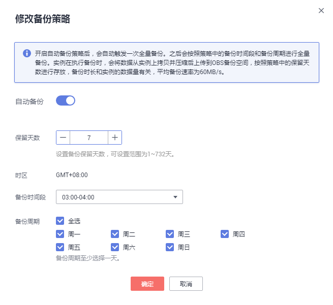
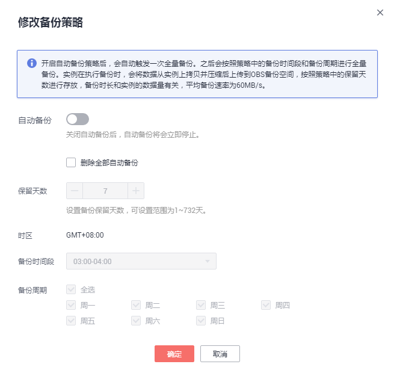

# 设置自动备份策略

## 操作场景

文档数据库服务按照设置的自动备份策略，对数据库进行自动备份。建议您定期对数据库进行备份，当数据库故障或数据损坏时，可以通过备份恢复数据库，从而保证数据可靠性。

## 注意事项

-   文档数据库服务会去检测已有的自动备份文件，若备份文件超过用户自定义的数据保留天数，则将其删除。
-   自动备份策略修改后，文档数据库服务将按照新的备份策略触发自动备份，原自动备份文件的保留天数不变。

-   备份将以压缩包的形式存储在对象存储服务。
-   创建实例时，默认开启自动备份策略，各参数项默认配置如下，创建成功后均可修改。
    -   备份文件默认保留7天。
    -   默认备份时间段为UTC时间。
    -   备份周期为周一～周日。

-   **本地电脑时间非东八区时区，如何设置备份时间段**

    案例分析：如果您的本地电脑时间非东八区时区，界面上设置备份时间段为每天00:00-01:00，由于界面上默认为“GMT+08:00”时区，那么实际备份时间段不是您本地时间00:00-01:00。

    解决方法：修改您本地电脑时间的时区为东八区，再设置实例的备份时间段为东八区时区的00:00-01:00。

## 开启或修改自动备份策略

1.  [登录文档数据库服务](https://support.huaweicloud.com/qs-dds/dds_02_0043.html)。
2.  在“实例管理“页面，选择指定的实例，单击实例名称。
3.  在左侧导航树，单击“备份恢复“。
4.  在“备份恢复“页面，单击“修改备份策略“，如需开启自动备份策略，单击。开启后，可以修改备份策略，如[图1](#fig997925593811)所示。

    **图 1**  修改社区版集群实例自动备份策略  
    

    保留天数是指自动备份可保留的时间，增加保留天数可提升数据可靠性，请根据需要设置。

    保留天数范围为1～732天，备份时间段为间隔1小时，其中，保留天数取值范围不同，备份周期约束如下：

    -   1～6天，备份周期默认全选，不可修改。
    -   7～732天，备份周期可选，但至少选择一周中的一天。

5.  单击“确定”，确认修改。
6.  查看备份结果。
    -   若开启自动备份策略，将立即触发一个全量的自动备份，备份完成的时间取决于实例的数据量。
    -   若修改自动备份策略，将在设置的备份时间段内随机触发一个全量的自动备份，备份完成的时间取决于实例的数据量。
    -   自动备份创建过程中，在“备份管理“或“备份恢复“页面，可查看自动备份的状态显示为“正在备份”。
    -   在备份列表的右上角，单击刷新列表，可看到自动备份创建成功的状态显示为“完成”。自动备份的备份类型为“自动”，备份方式为“物理备份”。

## 关闭自动备份策略

> **须知：**   
>关闭自动备份策略后，您需要注意以下几点：  
>-   文档数据库服务将不会对您的数据进行备份。  
>-   实例上已有的全部增量备份将会被删除。对于副本集实例，其恢复到指定时间点功能将不可用。  
>-   如果在关闭自动备份策略时，选择同步删除已有的全部自动备份，对于正在通过该自动备份进行恢复和下载的操作，将会执行失败。  

1.  [登录文档数据库服务](https://support.huaweicloud.com/qs-dds/dds_02_0043.html)。
2.  “实例管理“页面，选择指定的实例，单击实例名称。
3.  在左侧导航树，单击“备份恢复“。
4.  在“备份恢复“页面，单击“修改备份策略“，单击，关闭自动备份策略。关闭后，如[图2](#fig1758153018411)所示。

    **图 2**  关闭社区版集群实例自动备份策略  
    

    选择是否删除全部自动备份：

    -   不勾选，将保留当前还在保留天数内的备份文件，后期可手动删除，请参见[删除自动备份](删除自动备份.md)。
    -   勾选，删除当前还在保留天数内的备份文件。

5.  单击“确定”，确认关闭。

