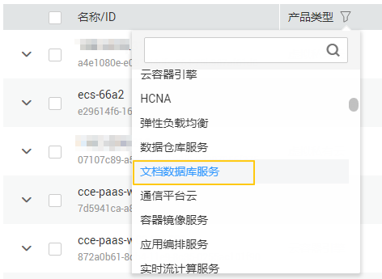
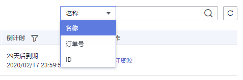

# 退订包周期实例

## 操作场景

-   对于“包年/包月”模式的数据库实例，您需要退订订单，从而删除数据库实例资源。

    如果包周期实例被冻结，您可以根据需要，在DDS界面或费用中心主动释放实例资源。通过费用中心释放资源的操作，请参见《费用中心用户指南》中“[如何释放资源](https://support.huaweicloud.com/usermanual-billing/zh-cn_topic_0077722189.html)”的内容。

-   对于“按需计费”模式的数据库实例，您需要在“实例管理“页面对其进行删除，更多操作请参见[删除按需实例](删除按需实例.md)。

## 方式一

您可以在文档数据库服务“实例管理“页面的实例列表中，退订包周期实例。

1.  [登录文档数据库服务](https://support.huaweicloud.com/qs-dds/dds_02_0043.html)。
2.  在“实例管理”页面，选择目标实例，在“操作“列选择“更多  \>  退订“。
3.  在弹出框中，单击“是“，进入“退订资源”页面。

    > **须知：**   
    >退订操作无法恢复，请谨慎操作。如需保留数据，请您在退订之前先创建一个手动备份。  

4.  在“退订资源”页面，确认待退订实例信息，并选择退订原因，单击“退订“。

    资源退订相关信息，请参考[退订规则说明](https://support.huaweicloud.com/usermanual-billing/zh-cn_topic_0083138805.html)。

5.  在弹出框中确认是否退订并删除该资源，单击“是“，提交退订申请。

    > **须知：**   
    >1.  提交退订后，资源和数据将会被删除并无法找回。  
    >2.  如需保留数据，请务必确认完成数据备份后再提交退订。  

6.  查看退订结果。数据库实例订单退订成功后，实例将会被删除，即文档数据库服务“实例管理“页面，将不再显示该订单对应的数据库实例。

## 方式二

您可前往“费用中心“，退订包周期实例。

1.  [登录文档数据库服务](https://support.huaweicloud.com/qs-dds/dds_02_0043.html)。
2.  单击页面右上角的“费用“，进入费用中心页面。
3.  在左侧导航栏中选择“退订与变更  \>  退订管理“，进入“退订管理“页面。
4.  在“退订管理“页面，勾选需要退订的实例订单，单击“操作“列的“退订资源“。
    -   您可通过产品类型筛选出账号下所有的文档数据库服务订单。

        **图 1**  筛选服务  
        

    -   您还可以在订单列表右上角，通过实例名称、订单号或实例ID搜索资源。

        **图 2**  搜索资源  
        

    -   单次操作允许最大退订资源数为20。

5.  在“退订资源”页面，确认待退订实例信息，并选择退订原因，单击“退订“。

    资源退订相关信息，请参考[退订规则说明](https://support.huaweicloud.com/usermanual-billing/zh-cn_topic_0083138805.html)。

6.  在弹出框中确认是否退订并删除该资源，单击“是“，提交退订申请。

    > **须知：**   
    >1.  提交退订后，资源和数据将会被删除并无法找回。  
    >2.  如需保留数据，请务必确认完成数据备份后再提交退订。  

7.  查看退订结果。数据库实例订单退订成功后，实例将会被删除，即文档数据库服务“实例管理“页面，将不再显示该订单对应的数据库实例。

