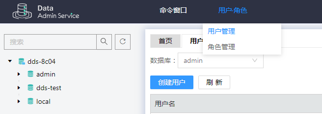
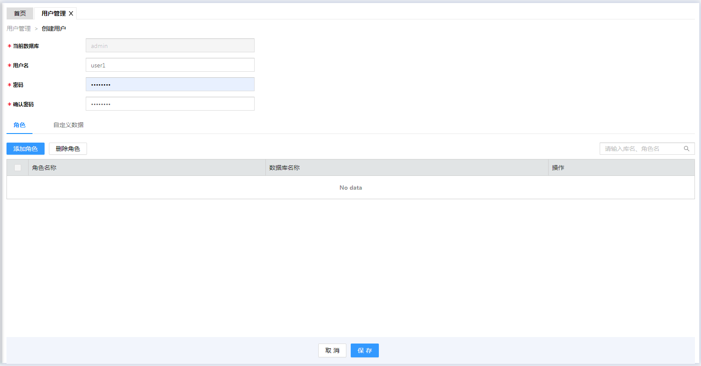
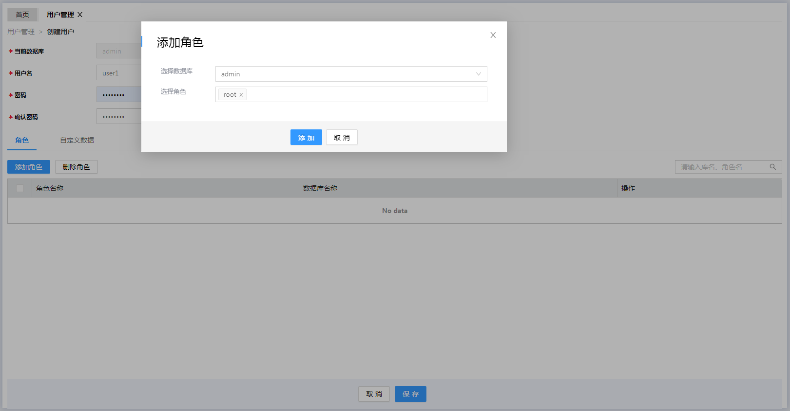
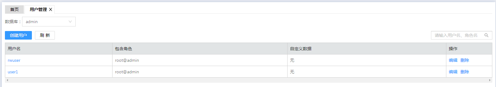

# 通过DAS创建数据库帐户

## 操作场景

为了更方便地管理文档数据库实例，创建数据库实例后，您可以通过数据管理服务（Data Admin Service，简称DAS）为其创建数据库帐户，以及更改帐户的密码。

> **说明：**   
>为目标实例创建数据库帐户时，建议您开启SSL通道，提高数据的安全性。  

## 使用限制

对于已有的3.2版本的文档数据库实例，不支持创建数据库帐户，仅可更改管理员帐户rwuser的密码。

## 前提条件

已通过DAS登录文档数据库实例。

-   登录集群实例，请参见[通过DAS连接集群实例](https://support.huaweicloud.com/qs-dds/dds_02_0041.html)。
-   登录副本集实例，请参见[通过DAS连接副本集实例](https://support.huaweicloud.com/qs-dds/dds_02_0044.html)。
-   登录单节点实例，请参见[通过DAS连接单节点实例](https://support.huaweicloud.com/qs-dds/dds_02_0045.html)。

## 帐户说明

为了给文档数据库实例提供管理服务，您在创建数据库实例时，文档数据库服务会自动为实例创建root（或admin）、monitor和backup帐户。如果试图删掉、重命名、修改这些帐户的密码和权限，会导致出错。

对于数据库管理员帐户rwuser，以及您所创建的帐户，允许修改帐户的密码。

## 帐户密码等级设置

-   文档数据库服务在控制台侧管理员密码的安全策略：
    -   密码长度为8～32个字符。
    -   密码必须为英文大小写字母、数字、特殊字符\~!@\#%^\*-\_=+?的组合。

-   文档数据库对在客户端新创的数据库用户，设置了密码安全策略：
    -   密码长度为8～32个字符。
    -   密码必须为英文大小写字母、数字、特殊字符\~@\#%-\_!\*+=^?的组合。

创建实例数据库时，为用户提供了密码复杂度校验，由于rwuser用户可以修改密码复杂度，安全起见，建议修改后的密码复杂度不低于最初设置的。

## 创建帐户

1.  已通过DAS登录文档数据库实例。
2.  在DAS界面上方，选择“用户·角色 \> 用户管理”，单击“创建用户”。

    **图 1**  用户管理  
    

3.  在“创建用户”页面，填写数据库帐户信息，下面以admin数据库创建root角色的user1帐户为例说明。
    1.  输入数据库帐户名及密码。

        **图 2**  创建用户  
        

    2.  单击“添加角色”，选择root角色，单击“添加”。

        **图 3**  添加角色  
        

    3.  单击“保存”后，确认SQL信息并完成创建。

4.  创建完成后，界面显示如下图所示。如需修改帐户密码或帐户角色，您可以单击“编辑”进行重置。

    **图 4**  创建完成  
    

