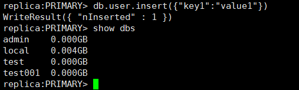

# 通过命令创建数据库

## 操作场景

数据库是表、索引、视图、存储过程、操作符的集合。为了更方便地管理文档数据库实例，创建数据库实例后，您可以通过命令为其创建数据库。如果数据库不存在，则创建数据库并切换到新创数据库，否则，直接切换到指定数据库。

## 前提条件

成功连接文档数据库实例，请参见《文档数据库服务快速入门》各实例类型下，通过内网和公网连接实例的内容。

## 操作步骤

1.  创建数据库。

    **use **_dbname_

    “_dbname_”是待创建数据库的名称。

    **图 1**  创建数据库  
    

2.  创建后必须向数据库中插入数据，才能在数据库的列表中看到新创建的数据库。

    **图 2**  插入数据  
    

    > **说明：**   
    >系统自带三个数据库：admin、local、test。如果不创建新的数据库，直接插入数据，则数据默认插入到test库中。  
    >**图 3**  查看数据库    
    >  

3.  查看数据库中的数据。

    **图 4**  查看数据  
    

